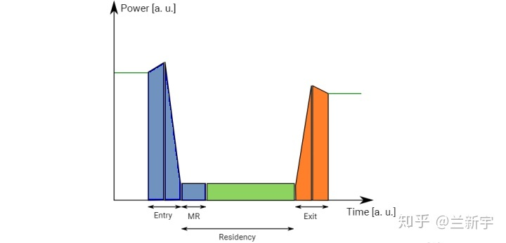
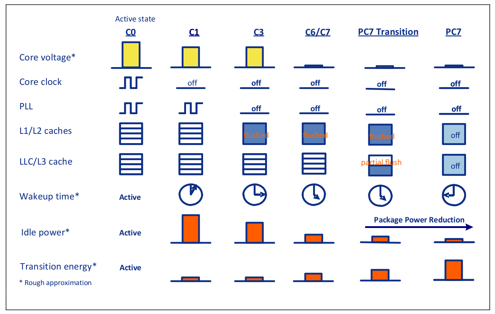
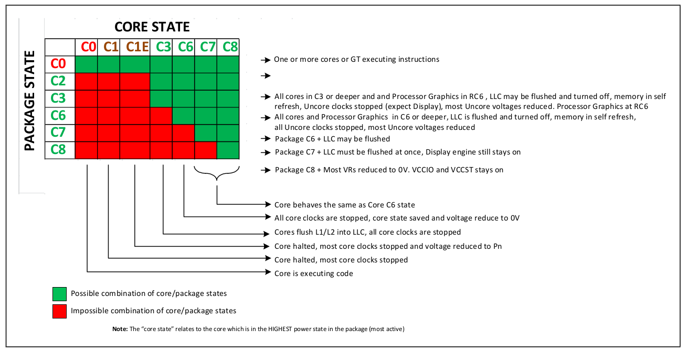

# C-state 如何节能
C-state存在多级，设置不同C-state级别从而在CPU idel时候关闭CPU内部的不同元器件，来较少能量损耗。

目前大部分的现在CPU具备多核（Core），多线程（Thread）的架构，多核被封装在一个单独的包（Package）中。
C-state根据CPU多核的特性被分成两组状态即，Package-state (PC-state) 和 Core-state（CC-state）。 由于Package中会共享一些组件对包中所有Core，所以只有在Pacakge中的所有Core全部子系统关闭，PC-state中的共享组件才可以断电，继而断电package。然而作为用户，我们无法直接控制PC-state，但是我们可以直接控制CC-state从而间接的控制PC-state。

# C-state 分级
C-state被分级成C0… 到CN，数值越大，节能效果越显著，随之而来需要更长的时间来唤醒CN状态到C0状态。C-state会根据CPU的idel时间长短，设置CPU的C-state的层级，idel时间越长，C-state会休眠越深，越多CPU内部的子系统会断电节能。

为此，CPU的设计者在硬件层面提供了不同的运行模式，以Intel的芯片为例（同时也是ACPI 的spec定义），包括了[P-state和C-state](https://software.intel.com/en-us/blogs/2008/03/12/c-states-and-p-states-are-very-different)。

在C-state的划分中，C0为正常工作模式，其他的"C1 ~ Cn"为休眠模式，这样CPU在无事可做时，就不用靠执行一些useless的指令来维持运行（软件idle），idle时进入休眠模式即可（称为"cpuidle"，或硬件/physical idle，对应的内核配置选项是`CONFIG_CPU_IDLE`）。有的休眠态是关闭部分时钟/电源（浅睡），有的是全部关闭（深睡），以供软件根据不同的场景选择。

| mode | 姓名 | 作用 | CPU |
| :---- | :---- | :---- | :---- |
| C0 | 操作状态 | CPU完全打开 | 所有CPU |
|C1	|停止	|通过软件停止 CPU 内部主时钟；总线接口单元和 APIC 仍然保持全速运行	|486DX4及以上|
|C1E|	增强型停止|	通过软件停止 CPU 内部主时钟并降低 CPU 电压；总线接口单元和 APIC 仍然保持全速运行	|所有socket 775 CPU|
|C1E|	—	|停止所有CPU内部时钟	|Turion 64、65-nm Athlon X2和Phenom CPU|
|C2	|停止授予	|通过硬件停止 CPU 内部主时钟；总线接口单元和 APIC 仍然保持全速运行	|486DX4及以上|
|C2	|停止时钟	|通过硬件停止CPU内部和外部时钟	|仅限486DX4、Pentium、Pentium MMX、K5、K6、K6-2、K6-III|
|C2E	|扩展的停止授予	通过硬件停止 CPU 内部主时钟并降低 CPU 电压；	|总线接口单元和 APIC 仍然保持全速运行 Core 2 Duo和更高版本（仅限Intel）|
|C3	|睡眠	|停止所有CPU内部时钟	|Pentium II、Athlon以上支持，但Core 2 Duo E4000和E6000上不支持|
|C3	|深度睡眠	|停止所有CPU内部和外部时钟	|Pentium II以上支持，但Core 2 Duo E4000、E6000和Turion 64上不支持|
|C3	|AltVID	|停止所有CPU内部时钟和降低CPU电压	|AMD Turion 64|
|C4	|更深入的睡眠	|降低CPU电压	|Pentium M以上支持，但Core 2 Duo E4000、E6000和Turion 64上不支持|
|C4E/C5	|增强的更深入的睡眠	|大幅降低CPU电压并关闭内存高速缓存	|Core Solo、Core Duo和45-nm移动版Core 2 Duo支持|
|C6	|深度电源关闭|	将 CPU 内部电压降低至任何值，包括 0 V	|仅45-nm移动版Core 2 Duo支持|

1. **C1/C1E**： 所有的X86 CPU都有个HLT(`Halt`)指令，调用后，CPU会进入idle模式，什么事也不干，直到收到中断。这里是个绝佳场所可以用来节电，Intel在这里引入了C1状态，关闭了时钟信号(内部bus和APIC除外)。由于时钟信号驱动内核里绝大多数部件，它的停止让这些设备也停止了运行，从而减少了电能消耗。有趣的是HLT指令自从8086开始就有了，这次的功能扩展几乎不要任何软件改动就能省电。在Core 2 Duo（酷睿2）引入了C1E（Enhanced Halt），在关闭时钟的基础上调低了电压，从而更加省电。如果你在固件中打开它，HLT时会自动进入C1E而不是C1。
2. **C2/C3**: C2也是在486DX引入，它增加了一个STPCLK(`Stop Clock`)引脚，这在某种程度上和C1很像，不同点在于，一个是软件触发的（C1），一个是硬件触发的（C2）。后来加入的关闭时钟发生器的功能让耗电进一步减少。后面C2E也出现了，C3开始内部的BUS和APIC时钟也被关闭。要特别强调的是，C1，C2和C3下，Cache一致性是得到保证的，从而恢复现场速度也很快。
3. **C4/C6/C7**: 越来越多内部设备的上下文状态信息（Context）也被封存和冻结，Catch被清空和关闭。如此一来，要恢复现场变得越来越耗时。同时Cache一致性也被破坏，OS需要知道它何时需要清理Cache。

休眠模式是存在代价的：进入和退出需要花费时间，退出恢复到正常状态的latency会影响对任务的响应，而且，进入和退出的过程本身也会损失一定的功耗（实际的"Entry"和"Exit"的功耗甚至可能短暂超过正常运行时的功耗）。

"n"值越大，睡眠程度越深，功耗节省越多，但恢复时间也越长。如果睡眠时间比较短，功耗没节省多少，时延又长，就很不合算。

LLC above refers to Last Level Cache, meaning the shared L3 cache in the processor.

下面是一个C-state节能的基本的时间线：
C0 （CPU正常执行指令）–> C1 (空闲的Core始终停止) --> C3 (空闲的Core L1/L2刷新并且Core断电) --> C8 (所有的Core断电并且L3刷新，整个Package断电)
我们上面提到PC-state和CC-state的关系，显然它们不是独立的，所以两者的所有组合也不是全部合理的：

ref: https://zhuanlan.zhihu.com/p/25675639