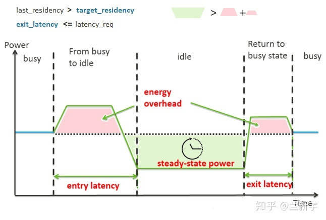

# 简介

当CPU没事可做的时候，软件层面采用的做法通常是：执行一个idle任务，这个idle任务是系统中优先级最低的，里面一般就是一个无限循环。但它还是会消耗能量，这实在有点不划算，对于移动设备更是浪费宝贵的电池资源，但是idle任务又必须执行，系统不能处在一个没有任何任务运行的状态。

在cmdline中设置`processor.max_cstate=0` 最大的cstate。


cpu特性引入： 
    多核 性能强劲，任务不足
    大小核： 性能核心可以休眠，能效核工作
    便携设备： 需要深度休眠，省点
目标： 
    可以休眠节电
    可以动态唤醒

# 框架
## governor 协调器
功能： 给CPU选择一个合适的idle state。表现为一个`cpuidle_governor`携带多种回调函数。
```C
struct cpuidle_governor {
	char			name[CPUIDLE_NAME_LEN];
	struct list_head 	governor_list; // 将该gover添加到一个全局的链表中
	unsigned int		rating;        // governor的级别
	int  (*enable)		(struct cpuidle_driver *drv, struct cpuidle_device *dev); // 准备governor协调器使能，是对要使能休眠态的CPU设备，进行一些必要的初始化工作。
	void (*disable)		(struct cpuidle_driver *drv, struct cpuidle_device *dev);
	int  (*select)		(struct cpuidle_driver *drv, struct cpuidle_device *dev, bool *stop_tick); // 选择一个合适的idle state。`stop_tick`表示在cpu进入指定状态的时候是否需要关闭scheduler tick。
	void (*reflect)		(struct cpuidle_device *dev, int index); // 评估选择的idle state的准确性，
};
```
## driver： 驱动，执行governor的判断结果

cpuidle_device: 对应一个CPU核心
```C
struct cpuidle_device {
	unsigned int		registered:1; // 该cpu核是否注册进内核中
	unsigned int		enabled:1;    // 该cpu核是否已经使能
	unsigned int		poll_time_limit:1;
	unsigned int		cpu;
	ktime_t			next_hrtimer;
	int			last_state_idx;
	u64			last_residency_ns;  //该cpu核上一次停留在cpuidle状态的时间, 单位ns
	u64			poll_limit_ns;
	u64			forced_idle_latency_limit_ns;
	struct cpuidle_state_usage	states_usage[CPUIDLE_STATE_MAX]; //struct cpuidle_state_usage数组，记录每个cpuidle状态的统计信息，包括是否使能、进入该cpuidle状态的次数，停留在该cpuidle状态的总时间（us）；
	struct cpuidle_state_kobj *kobjs[CPUIDLE_STATE_MAX]; //与sysfs组织相关，开发给用户层来操作底层；
	struct cpuidle_driver_kobj *kobj_driver;
	struct cpuidle_device_kobj *kobj_dev;
	struct list_head 	device_list;  // 全局链表，链接到cpuidle_detected_device上；
	cpumask_t		coupled_cpus;
	struct cpuidle_coupled	*coupled;
};
```

关闭一些核可以节省功耗，但关闭之后对时延(性能)必会造成一定的影响，如果在关闭之后很短的时间内就被唤醒，那么就会造成功耗/性能双方都不讨好，在进入退出idle的过程中也是会有功耗的损失的，如果在idle状态下面节省的功耗还无法弥补进入退出该idle的功耗，那么反而会得不偿失。根据性能/功耗的的这种矛盾，很多厂家会制定多个层级的idle状态，在每个层级下面的功耗、进入退出idle的功耗损失、以及进入退出的延迟都会是不同的数值，而cpuidle framework会根据不同的场景来进行仲裁选择使用何种的idle状态。

- cpuidle_state： 
    - target_residency_ns： ns单位，进入该状态的最小时间
    - target_residency： ms单位，期望的停留时间，进入退出idle状态是需要额外的功耗的，如果cpu很快进入退出idle状态，那么它的额外的功耗损失可能还弥补不了处于idle状态的功耗收益，从上面的图形中比较容易理解。所以就有了这样的一个指标，当cpu在idle状态下面停留超过一个的时间，才不会有功耗的损失，而这个临界点就是这里面提到的期望的停留时间，不同的平台和不同的idle等级下面这个值大小是不同的，Cpuidle Governor也会根据该数值来进行idle level的选择。
    - exit_latency： ms单位，CPU从该idle state下返回运行状态的延迟。是从被唤醒，到恢复到能够正常执行指令所需的时间。如果不幸在enter的时候就被唤醒，那也得先咬着牙把enter的过程走完再exit，这时`exit latency`就得把还在enter阶段的那段时间也算上去。这个参数通常被拿来和`latency_req`比较，后者代表了对延迟的容忍程度。
    - flags： 
    - power_usage: cpu在该idle state下的功耗，单位nw
    - enter： `void (*enter) (struct cpuidle_device *dev, struct cpuidle_driver *drv, int index)`, 该状态的回调函数
    - enter_dead: `void (*enter_dead) (struct cpuidle_device *dev, int index)`
    - enter_s2idle: suspend-to-idle system-wide power management feature，会关掉本地tick或者整个timekeeping，有可能和enter相同。

cpuidle driver用于驱动一个或多个CPU核，主要工作是定义所支持的cpuidle state，以及state的enter接口，cpudile driver就要负责将平台定义的idle-state信息填充到这个结构体中
关键字段描述如下：
```C
struct cpuidle_driver {
	const char		*name;
	struct module 		*owner;
	unsigned int            bctimer:1; // 用于驱动注册时判断是否需要设置broadcast timer；
	struct cpuidle_state	states[CPUIDLE_STATE_MAX]; // struct cpuidle_state数组，用于描述cpuidle的状态，需要按照功耗从大到小来排序，具体有多少个cpuidle状态，取决于device Tree中的定义，默认已经有state[0]，
	int			state_count;          // 该driver支持的cpuidle state及其个数
	int			safe_state_index;
	struct cpumask		*cpumask; // 用于表明支持哪些CPU
	const char		*governor;    // 期望的governor
};
```
## core framework： 调度框架， 启动命令行指定`cpuidle.governor=`
休眠的单位是什么： 

- cpuidle_register_governor()： 注册governor
- cpuidle_register_driver: 注册driver
- cpuidle_register
- cpuidle_unregister_device
- cpuidle_unregister_driver
- cpuidle_unregister
- cpuidle_pause_and_lock
- cpuidle_disable_device
- cpuidle_enable_device
- cpuidle_resume_and_unlock

# 2种idle_driver

There exist two different cpuidle drivers on the X86 architecture platform:
1. "acpi_idle" cpuidle driver： The acpi_idle cpuidle driver retrieves available sleep states (C-states) from the ACPI BIOS tables (from the _CST ACPI function on recent platforms or from the FADT BIOS table on older ones). The C1 state is not retrieved from ACPI tables. If the C1 state is entered, the kernel will call the hlt instruction (or mwait on Intel).
2. "intel_idle" cpuidle driver： In kernel 2.6.36 the intel_idle driver was introduced. It only serves recent Intel CPUs (Nehalem, Westmere, Sandybridge, Atoms or newer). On older Intel CPUs the acpi_idle driver is still used (if the BIOS provides C-state ACPI tables). The intel_idle driver knows the sleep state capabilities of the processor and ignores ACPI BIOS exported processor sleep states tables.

# 4种governor
在当前的内核中，有两种主流的governor策略：ladder和menu，选择哪一种取决于内核的配置，ladder在periodic timer tick system中使用，menu在tickless system中使用。

- menu
- teo
- ladder
- haltpoll


## menu
菜单式的策略，即只要具备进入更深层次idle state的条件，系统就可以选择进入到该idle state中，不需要从浅到深逐层递进。
menu governor使用性能乘数（performance multiplier）、预计停留时间（predicted）和系统延迟需求（latency requirement）来找出最大退出延迟。

系统容忍度 =  min(1, 2)
    (latency requirement)
    predicted_us / (1 +10 * iowaiters)   // iowaiters指当前cpu上iowait的任务数

影响menu governor切换状态的3个因素： 
1. Energy break even point(能量盈亏平衡点)：CState进出都需要额外的能耗，"target_residency"是期望/目标（target）在这个休眠态驻留（reside）的最少时间，比这个时间更少的话，在休眠态节省的功耗（下图绿色梯形的面积）还抵不过切换休眠态浪费的功耗（红色梯形的面积）。实际驻留时间"last_residency"大于target，才划得来（break even）。在讲cpuidle core的时候有提到cpuidle_state中有个成员变量，名为target_residency（期望的停留时间），这个可以认为是在一次切换过程中满足功耗不损失的min时间值，所以这里切换的代价落到实处就是需要在选择idle state的时候需要cpu在c state的停留时间要超过target_residency，这里的停留时间系统有一个术语来进行表征：预测时间（predicted_us）。这些评估的时间都是比较乐观的，cpu可能因为其他的事件导致唤醒，比如中断。所以需要一个修改因子(`correction factor`).

在计算predict的过程中，`menu governor`会将下一个tick到来的时间点距离此刻的时间（next_timer_us）作为一个基础的predicted_us，并在这个基础上调整。

首先，因为predicted_us并不总是与next_timer_us直接相等，在等待下一个tick的过程很有可能被其他事件所唤醒，所以需要引入校正因子(correction factor)矫正predicted_us。此校正因子从对应的`bucket`索引中选取。menu governor使用了一组12组校正因子来预测空闲时间，校正因子的值基于过去predicted_us和next_timer_us的比率，并且采用动态平均算法。另外对于不同的next_timers_us，校正因子的影响程度是不一样的；对于不同的io wait场景，系统对校正因子也有着不同的敏感程度 。

其次：(Repeatable-interval-detector) 尝试通过最近的8个过去的停留时间来查找重复间隔，如果他们的标准差小于一定阈值，则将这8个时间的平均值作为predicted_us。方差小于400平方ms或者平均值大于标准差的6备，平均值比较稳定。否则丢掉最大值，再计算。

最后取以上两个流程中的最小值。

2. 性能影响： 性能乘数(performance multiplier)

3. 延迟容忍度：系统延迟需求（latency requirement）。系统延迟容忍度主要是考虑对性能的影响, 由pm qos获得的，系统期望的，CPU和DMA的延迟需求,这是一个硬性指标。kernel会通过pm qos来获取当前系统对延迟的容忍度（latency_req），接下来governors所要做的事情就是在备选的几个c-state中，在所有exit_latency小于latency_req的state中，选取功耗（power_usage）最小的那个即可。

```C
struct menu_device {
	int             needs_update; // 在系统每次从Cstate返回时，会调用reflect接口，用于考虑这次state切换的结果，menu governor的reflect接口会将need_update设置为1，在下次进入select时对idle信息进行更新
	int             tick_wakeup;  // 记录上次退出C状态是否是被tick唤醒
	u64		next_timer_ns;        // 记录距离下一个tick到来的时间
	unsigned int	bucket;       // 记录在当前的校正因子的位置
	unsigned int	correction_factor[BUCKETS]; // 保存校正因子的数组
	unsigned int	intervals[INTERVALS]; // 计算标准差时所采用的停留时间
	int		interval_ptr;
};
```

```C
static int menu_select(struct cpuidle_driver *drv, struct cpuidle_device *dev, bool *stop_tick)
{
	struct menu_device *data = this_cpu_ptr(&menu_devices);
	s64 latency_req = cpuidle_governor_latency_req(dev->cpu); // 获取系统CPU和DMA所能容忍的延迟。因为cpuidle状态下，运行任何的中断事件唤醒，因此这里只考虑了CPU和DMA；
	unsigned int predicted_us;
	u64 predicted_ns;
	u64 interactivity_req;
	unsigned int nr_iowaiters;
	ktime_t delta, delta_tick;
	int i, idx;

	if (data->needs_update) { // 更新上一次进入idle状态的信息
		menu_update(drv, dev);
		data->needs_update = 0;
	}

	delta = tick_nohz_get_sleep_length(&delta_tick); // 获取下一次tick的时间段，这个就是初始的predicted_ns
	if (unlikely(delta < 0)) {
		delta = 0;
		delta_tick = 0;
	}
	data->next_timer_ns = delta;

	nr_iowaiters = nr_iowait_cpu(dev->cpu);
	data->bucket = which_bucket(data->next_timer_ns, nr_iowaiters);

	if (unlikely(drv->state_count <= 1 || latency_req == 0) ||
	    ((data->next_timer_ns < drv->states[1].target_residency_ns ||
	      latency_req < drv->states[1].exit_latency_ns) &&
	     !dev->states_usage[0].disable)) { // 各种原因不能进入idle

		*stop_tick = !(drv->states[0].flags & CPUIDLE_FLAG_POLLING);
		return 0;
	}

	/* Round up the result for half microseconds. */
	predicted_us = div_u64(data->next_timer_ns *
			       data->correction_factor[data->bucket] +
			       (RESOLUTION * DECAY * NSEC_PER_USEC) / 2,
			       RESOLUTION * DECAY * NSEC_PER_USEC);
	/* Use the lowest expected idle interval to pick the idle state. */
	predicted_ns = (u64)min(predicted_us,
				get_typical_interval(data, predicted_us)) *
				NSEC_PER_USEC;

	if (tick_nohz_tick_stopped()) {
		/*
		 * If the tick is already stopped, the cost of possible short
		 * idle duration misprediction is much higher, because the CPU
		 * may be stuck in a shallow idle state for a long time as a
		 * result of it.  In that case say we might mispredict and use
		 * the known time till the closest timer event for the idle
		 * state selection.
		 */
		if (predicted_ns < TICK_NSEC)
			predicted_ns = data->next_timer_ns;
	} else {
		/*
		 * Use the performance multiplier and the user-configurable
		 * latency_req to determine the maximum exit latency.
		 */
		interactivity_req = div64_u64(predicted_ns,
					      performance_multiplier(nr_iowaiters));
		if (latency_req > interactivity_req)
			latency_req = interactivity_req;
	}

	/*
	 * Find the idle state with the lowest power while satisfying
	 * our constraints.
	 */
	idx = -1;
	for (i = 0; i < drv->state_count; i++) {
		struct cpuidle_state *s = &drv->states[i];

		if (dev->states_usage[i].disable)
			continue;

		if (idx == -1)
			idx = i; /* first enabled state */

		if (s->target_residency_ns > predicted_ns) {
			/*
			 * Use a physical idle state, not busy polling, unless
			 * a timer is going to trigger soon enough.
			 */
			if ((drv->states[idx].flags & CPUIDLE_FLAG_POLLING) &&
			    s->exit_latency_ns <= latency_req &&
			    s->target_residency_ns <= data->next_timer_ns) {
				predicted_ns = s->target_residency_ns;
				idx = i;
				break;
			}
			if (predicted_ns < TICK_NSEC)
				break;

			if (!tick_nohz_tick_stopped()) {
				/*
				 * If the state selected so far is shallow,
				 * waking up early won't hurt, so retain the
				 * tick in that case and let the governor run
				 * again in the next iteration of the loop.
				 */
				predicted_ns = drv->states[idx].target_residency_ns;
				break;
			}

			/*
			 * If the state selected so far is shallow and this
			 * state's target residency matches the time till the
			 * closest timer event, select this one to avoid getting
			 * stuck in the shallow one for too long.
			 */
			if (drv->states[idx].target_residency_ns < TICK_NSEC &&
			    s->target_residency_ns <= delta_tick)
				idx = i;

			return idx;
		}
		if (s->exit_latency_ns > latency_req)
			break;

		idx = i;
	}

	if (idx == -1)
		idx = 0; /* No states enabled. Must use 0. */

	/*
	 * Don't stop the tick if the selected state is a polling one or if the
	 * expected idle duration is shorter than the tick period length.
	 */
	if (((drv->states[idx].flags & CPUIDLE_FLAG_POLLING) ||
	     predicted_ns < TICK_NSEC) && !tick_nohz_tick_stopped()) {
		*stop_tick = false;

		if (idx > 0 && drv->states[idx].target_residency_ns > delta_tick) {
			/*
			 * The tick is not going to be stopped and the target
			 * residency of the state to be returned is not within
			 * the time until the next timer event including the
			 * tick, so try to correct that.
			 */
			for (i = idx - 1; i >= 0; i--) {
				if (dev->states_usage[i].disable)
					continue;

				idx = i;
				if (drv->states[i].target_residency_ns <= delta_tick)
					break;
			}
		}
	}

	return idx;
}
```


## ladder

阶梯式的策略，即要到更高的层级必须从低层级step by step上去，在ladder策略中，ladder governor会首先进入最浅的idle state，然后如果待的时间足够长，则会进入到更深一级的idle state，以此类推，直到到达最深的idle state，被唤醒时，会尽可能快地重新启动CPU；等到下次空闲，则又会从idle state1开始进入。在这种策略中，系统可能长时间都不进入最深的idle state中，造成功耗低一些损失。
##  Timer Events Oriented (TEO)


# Idle CPUs and The Scheduler Tick
The kernel can be configured to disable stopping the scheduler tick in the idle loop altogether. That can be done through the build-time configuration of it (by unsetting the CONFIG_NO_HZ_IDLE configuration option) or by passing nohz=off to it in the command line. In both cases, as the stopping of the scheduler tick is disabled, the governor’s decisions regarding it are simply ignored by the idle loop code and the tick is never stopped.

The systems that run kernels configured to allow the scheduler tick to be stopped on idle CPUs are referred to as tickless systems and they are generally regarded as more energy-efficient than the systems running kernels in which the tick cannot be stopped. If the given system is tickless, it will use the menu governor by default and if it is not tickless, the default CPUIdle governor on it will be ladder.


# 代码段范围

driver/cpuidle/cpuidle.c
driver/cpuidle/driver.c
driver/cpuidle/governor.c
driver/cpuidle/sysfs.c
kernel/shced/idle.c


# 管理工具

cpupower-idle-set： Utility to set cpu idle state specific kernel options
cpupower [ -c cpulist ] idle-info [options]
cpupower [ -c cpu ] frequency-set [options]

## sysfs
/sys/devices/system/cpu/cpu*/cpuidle/state*
/sys/devices/system/cpu/cpuidle/*