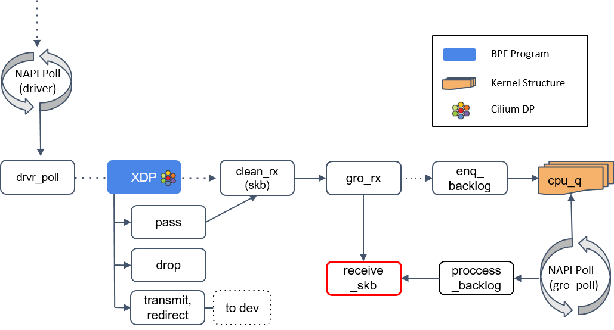
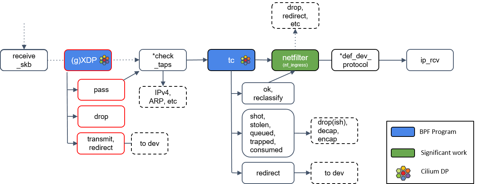
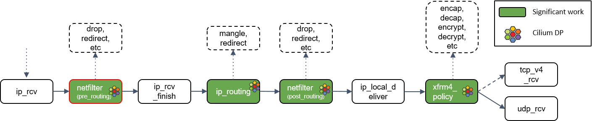
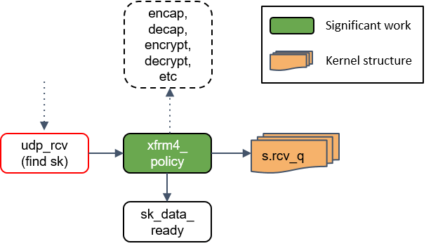

# 工具
网络可视化工具hubble

# 功能

1. (veth-pair）。这个ARP响应是通过Cilium Agent通过挂载的eBPF程序实现的自动应答，并且将veth-pair对端的MAC地址返回，避免了虚拟网络中的ARP广播问题。
2. cilium_vxlan进行隧道相关的封包、解包处理。在物理网卡eth0抓包可以发现，Pod1出发的数据包经过cilium_vxlan的封装处理之后，其源目的地址已经变成物理主机node-161和node-162，这是经典的overlay封装。同时，还可以发现，cilium_vxlan除了对数据包进行了隧道封装之外，还将原始数据包进行了TLS加密处理，保障了数据包在主机外的物理网络中的安全性
3. Cilium Agent采用eBPF实现对数据包的重定向，将需要进行过滤的数据包首先转发至Proxy代理，Proxy代理根据其相应的过滤规则，对收到的数据包进行过滤，然后再将其发回至数据包的原始路径，而Proxy代理进行过滤的规则，则通过Cilium Agent进行下发和管理。

# datapath

## NAPI poll
NAPI poll 机制不断调用驱动实现的 poll 方法，后者处理 RX 队列内的包，并最终 将包送到正确的程序。

## XDP程序处理

XDP 全称为 eXpress Data Path，是 Linux 内核网络栈的最底层。它只存在于 RX （接收数据）路径上，允许在网络设备驱动内部网络堆栈中数据来源最早的地方进行数据包处理，在特定模式下可以在操作系统分配内存（skb）之前就已经完成处理。
插播一下 XDP 的工作模式：
XDP 有三种工作模式，默认是 native（原生）模式，当讨论 XDP 时通常隐含的都是指这种模式。

1. Native XDP： XDP 程序 hook 到网络设备的驱动上，它是 XDP 最原始的模式，因为还是先于操作系统进行数据处理，它的执行性能还是很高的，当然需要网卡驱动支持。大部分广泛使用的 10G 及更高速的网卡都已经支持这种模式。
2. Offloaded XDP： XDP 程序直接 hook 到可编程网卡硬件设备上，与其他两种模式相比，它的处理性能最强；由于处于数据链路的最前端，过滤效率也是最高的。如果需要使用这种模式，需要在加载程序时明确声明。
3. Generic XDP： 对于还没有实现 native 或 offloaded XDP 的驱动，内核提供了一个 generic XDP 选项，这是操作系统内核提供的通用 XDP 兼容模式，它可以在没有硬件或驱动程序支持的主机上执行 XDP 程序。在这种模式下，XDP 的执行是由操作系统本身来完成的，以模拟 native 模式执行。好处是，只要内核够高，人人都能玩 XDP；缺点是由于是仿真执行，需要分配额外的套接字缓冲区（SKB），导致处理性能下降，跟 native 模式在10倍左右的差距。

对于在生产环境使用 XDP，推荐要么选择 native 要么选择 offloaded 模式。这两种模式需要网卡驱动的支持，对于那些不支持 XDP 的驱动，内核提供了 Generic XDP ，这是软件实现的 XDP，性能会低一些， 在实现上就是将 XDP 的执行上移到了核心网络栈。

继续回来介绍 ，分两种情况：native/offloaded 模式、general 模式。

(1) native/offloaded 模式：XDP 在内核收包函数 receive_skb() 之前。

(2) Generic XDP 模式：XDP 在内核收包函数 receive_skb() 之后。

XDP 程序返回一个判决结果给驱动，可以是 PASS, TRANSMIT, 或 DROP。

1. TRANSMIT 非常有用，有了这个功能，就可以用 XDP 实现一个 TCP/IP 负载均衡器。XDP 只适合对包进行较小修改，如果是大动作修改，那这样的 XDP 程序的性能可能并不会很高，因为这些操作会降低 poll 函数处理 DMA ring-buffer 的能力。
2. 如果返回的是 DROP，这个包就可以直接原地丢弃了，而无需再穿越后面复杂的协议栈然后再在某个地方被丢弃，从而节省了大量资源。在业界最出名的一个应用场景就是 Facebook 基于 XDP 实现高效的防 DDoS 攻击，其本质上就是实现尽可能早地实现「丢包」，而不去消耗系统资源创建完整的网络栈链路，即「early drop」。
3. 如果返回是 PASS，内核会继续沿着默认路径处理包，如果是 native/offloaded 模式 ，后续到达 clean_rx() 方法；如果是 Generic XDP 模式，将导到 check_taps()下面的 Step 6 继续讲解。

## L2层

1. napi poll
2. xdp在驱动层poll，要求驱动支持xdp。XDP 程序返回一个判决结果给驱动，可以是 PASS, TRANSMIT, 或 DROP。
   1. transmit可以做数据包修改，在转发给设备
   2. drop直接删除
   3. pass默认路径处理，进入clean_rx()
3. clean_rx()：创建 skb, 更新一些统计信息，对 skb 进行硬件校验和检查，然后将其交给 gro_receive() 方法.
4. gro_receive(): GRO 是一种较老的硬件特性（LRO）的软件实现，功能是对分片的包进行重组然后交给更 上层，以提高吞吐。GRO 给协议栈提供了一次将包交给网络协议栈之前，对其检查校验和 、修改协议头和发送应答包（ACK packets）的机会。
   1. 如果 GRO 的 buffer 相比于包太小了，它可能会选择什么都不做。
   2. 如果当前包属于某个更大包的一个分片，调用 enqueue_backlog 将这个分片放到某个 CPU 的包队列。当包重组完成后，会交给 receive_skb() 方法处理。
   3. 如果当前包不是分片包，直接调用 receive_skb()，进行一些网络栈最底层的处理。
5. receive_skb() 之后会再次进入 XDP 程序点。

## L2 -> L3 

1. 通用 XDP 处理（gXDP）: 如果网卡驱动不支持 XDP，那 XDP 程序将延迟到更后面执行，这个 “更后面”的位置指的就是这里的 (g)XDP。有3种处理结果： transmit、pass和drop。
2. Tap 设备处理: 图中有个 *check_taps 框，但其实并没有这个方法：receive_skb() 会轮询所有的 socket tap，将包放到正确的 tap 设备的缓冲区。tap 设备监听的是三层协议（L3 protocols），例如 IPv4、ARP、IPv6 等等。如果 tap 设 备存在，它就可以操作这个 skb 了。Tun 设备是一个三层设备，从 /dev/net/tun 字符设备上读取的是 IP 数据包，写入的也只能是 IP 数据包，因此不能进行二层操作，如发送 ARP 请求和以太网广播。Tap 设备是三层设备，处理的是二层 MAC 层数据帧，从 /dev/net/tun 字符设备上读取的是 MAC 层数据帧，写入的也只能是 MAC 层数据帧。从这点来看，Tap 虚拟设备和真实的物理网卡的能力更接近。
3. tc（traffic classifier）处理, 接下来我们遇到了第二种 eBPF 程序：tc eBPF。tc（traffic classifier，流量分类器）是 Cilium 依赖的最基础的东西，它提供了多种功 能，例如修改包（mangle，给 skb 打标记）、重路由（reroute）、丢弃包（drop），这 些操作都会影响到内核的流量统计，因此也影响着包的排队规则（queueing discipline ）。Cilium 控制的网络设备，[至少被加载了一个 tc eBPF 程序](http://arthurchiao.art/blog/cilium-network-topology-on-aws/)。
4. Netfilter 处理: 如果 tc BPF 返回 OK，包会再次进入 Netfilter。Netfilter 也会对入向的包进行处理，这里包括 nftables 和 iptables 模块。有一点需要记住的是：Netfilter 是网络栈的下半部分（the “bottom half” of the network stack），因此 iptables 规则越多，给网络栈下半部分造成的瓶颈就越大。*def_dev_protocol 框是二层过滤器（L2 net filter），由于 Cilium 没有用到任何 L2 filter，因此这里我就不展开了。

## L3 协议层处理：ip_rcv()
如果包没有被前面丢弃，就会通过网络设备的 ip_rcv() 方法进入协议栈的三层（ L3）—— 即 IP 层 —— 进行处理。
## L3 -> L4（网络层 -> 传输层）

11. ip_rcv() 做的第一件事情是再次执行 Netfilter 过滤，因为我们现在是从四层（L4）的 视角来处理 socker buffer。因此，这里会执行 Netfilter 中的任何四层规则（L4 rules ）。
12. ip_rcv_finish() 处理: Netfilter 执行完成后，调用回调函数 ip_rcv_finish()。ip_rcv_finish() 立即调用 ip_routing() 对包进行路由判断。
13. ip_routing() 处理: ip_routing() 对包进行路由判断，例如看它是否是在 lookback 设备上，是否能 路由出去（could egress），或者能否被路由，能否被 unmangle 到其他设备等等。在 Cilium 中，如果没有使用隧道模式（tunneling），那就会用到这里的路由功能。相比 隧道模式，路由模式会的 datapath 路径更短，因此性能更高。
14. 目的是本机：ip_local_deliver() 处理: 根据路由判断的结果，如果包的目的端是本机，会调用 ip_local_deliver() 方法。ip_local_deliver() 会调用 xfrm4_policy()。
15. xfrm4_policy() 处理: xfrm4_policy() 完成对包的封装、解封装、加解密等工作。例如，IPSec 就是在这里完成的最后，根据四层协议的不同，ip_local_deliver() 会将最终的包送到 TCP 或 UDP 协议 栈。这里必须是这两种协议之一，否则设备会给源 IP 地址回一个 ICMP destination unreachable 消息。

## L4（传输层，以 UDP 为例）
接下来我将拿 UDP 协议作为例子，因为 TCP 状态机太复杂了，不适合这里用于理解 datapath 和数据流。但不是说 TCP 不重要，Linux TCP 状态机还是非常值得好好学习的。

16. udp_rcv() 处理: udp_rcv() 对包的合法性进行验证，检查 UDP 校验和。然后，再次将包送到 xfrm4_policy() 进行处理。
17. xfrm4_policy() 再次处理: 这里再次对包执行 transform policies 是因为，某些规则能指定具体的四层协议，所以只 有到了协议层之后才能执行这些策略。
18. 将包放入 socket_receive_queue: 这一步会拿端口（port）查找相应的 socket，然后将 skb 放到一个名为 socket_receive_queue 的链表。
19. 通知 socket 收数据：sk_data_ready(),最后，udp_rcv() 调用 sk_data_ready() 方法，标记这个 socket 有数据待收。一个 socket 就是 Linux 中的一个文件描述符，这个描述符有一组相关的文件操 作抽象，例如 read、write 等等。

[ref1](https://juejin.cn/post/7088335459738189860)