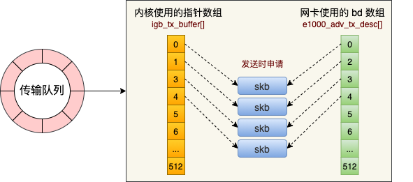

- [Linux网络模型](#linux网络模型)
- [功能框架](#功能框架)
  - [完整的收包过程](#完整的收包过程)
- [数据结构](#数据结构)
- [网络模型初始化](#网络模型初始化)
- [socket模块系统接口层](#socket模块系统接口层)
  - [socket 创建socket接口](#socket-创建socket接口)
  - [recv接口会执行recvfrom系统调用](#recv接口会执行recvfrom系统调用)
  - [accept创新新的点对点socket](#accept创新新的点对点socket)
  - [epoll\_create创建eventpoll内核对象](#epoll_create创建eventpoll内核对象)
  - [epoll\_ctl注册socket](#epoll_ctl注册socket)
  - [send](#send)
- [L4层](#l4层)
- [TCP](#tcp)
- [L3网络层](#l3网络层)
  - [收包过程](#收包过程)
- [L2邻居子系统](#l2邻居子系统)
- [网络设备子系统](#网络设备子系统)
- [驱动层igb](#驱动层igb)
  - [网卡驱动初始化](#网卡驱动初始化)
  - [启动网卡](#启动网卡)
  - [收包](#收包)
- [网络子系统初始化](#网络子系统初始化)
- [协议栈注册(ip/tcp/udp)](#协议栈注册iptcpudp)
- [netfilter](#netfilter)


# Linux网络模型

对应OSI七层模型，在Linux系统中网络模型涉及到用户态进程管理，实现会话层表示层等业务接口。通过socket接口系统调用实现网络服务器端和客户端的网络首发能力。在用户态和内核态之间就是socket系统调用层。通过socket系统调用层，用户网络数据进入内核网络协议族包括L4传输层(tcp,udp),L3网络层(ipv4, ipv6，icmp，igmp), 邻居子(路由管理系统)系统，l2链路层和网络驱动层。

在linux内核网络中包含着tc模块和netfilter模块实现网络的控制，我们顺便看一下ebpf的接口位置。

网络模型涉及到几个模块：

1. socket模型，file， eventpoll，task_struct，就是接口调用模型
2. pcie设备驱动
3. net设备驱动：驱动功能
4. 软中断模型
5. 协议层： 网络层 传输层 邻居子系统 netfilter, tc, ebpf 


# 功能框架

## 完整的收包过程

硬件驱动层-硬软中断模型-协议层

1. 数据帧从外部达到网卡，网卡负责将帧DMA到内存。(网卡硬件行为)
2. 发送硬中断通知CPU： 中断、msix、中断亲和性
3. CPU调用网卡驱动注册的中断响应函数
4. 硬件中断处理函数发出软中断，释放cpu
5. ksoftirqd进程处理软中断，调用网卡驱动注册的poll函数开始收包。poll软中断上下文，控制2个hz之间，避免其他中断处理函数延迟。
6. 网卡驱动poll从ringbuffer上将帧拷贝保存为一个skb，校验，初始化基础配置，准备进入协议层。
7. skb被`netif_receive_skb`抛到上层协议层处理网络帧，最终放在socket的接收队列中。


1. 应用层： 
   1. send()
   2. socket(AF_INET, SOCK_DGRAM, 0) //调用该函数来创建一个socket结构体，并初始化相应的操作函
   3. bind(fd, &server_address, )  // server, 
   4. listen() // server
   5. accept() // server
   6. recvmsg()
   7. recvfrom(fd, buff, buff_size, 0, ...)
   8. connect() //client
   9. sendmsg()
   10. shutdown() 
   11. connect() //client
2. 系统调用层, `net/socket.c`
   1. sendto
   2. sock_sendmsg
3. 协议层： ipv4/ipv6,af_inet
   1. 传输层：tcp/udp
      1. inet_sendmsg(): 协议框架调用发送
      2. tcp_sendmsg(iocb, sk, msg, size): ipv4 tcp层发送数据
      3. tcp_transmit_skb
      4. queue_xmit() // 网络层接口
   2. 网络层： ipv4/ipv6
      1. ip_queue_xmit(struct sk_buff *skb, struct flowi *fl)
      2. ip_local_out(skb)
      3. ip_finish_output2(struct sk_buff *skb)
      4. dst_neigh_output(dst, neigh, skb) //链路层接口
   3. 邻居系统：
      1. neigh_hh_output
      2. skb_push
      3. dev_queue_xmit(skb) // 设备层
4. 网络设备层
   1. dev_queue_xmit(struct sk_buff *skb)
   2. netdev_pick_tx(dev, skb) // 选择发送队列并获取qdisc
   3. rcu_dereference_bh(qdisc)
   4. __dev_xmit_skb(skb, q, dev, txq)
   5. dev_hard_start_xmit()
   6. ndo_start_smit(skb, dev) // 驱动层接口
5. 驱动层： igb为例
   1. igb_xmit_frame()
   2. igb_xmit_frame_ring(skb) 
   3. igb_tx_map(tx_ring, firt, hdr_len) //设备发送
   4. igb_msix_ring(int irq, void *data) //设备发送完成发送硬中断通知cpu
   5. napi_schedule(q_vector->napi) // 
   6. __raise_softirq_irqoff(NET_RX_SOFTIRQ) // 触发软中断, 这个软中断是接收和发送完成都会触发，所以在/proc/softirqs接收会比发送大很多
   7. net_rx_action(struct softirq_action *h) // 软中断处理函数，调动worker 网卡驱动的poll的函数
   8. igb_poll(struct napi_struct *napi, int budget) // 网卡驱动执行发送完成后的清理工作
   9. igb_clean_tx_irq(q_vector)
   10. dev_kfree_skb_any(tx_buffer->skb) //释放skb
   11. dma_unmap_len_set(tx_buffer,len ,0) //清楚tx_buffer


# 数据结构

- socket： 包含file、sock、proto_ops, 和task_struct对应。
- sock： 传输层处理协议sk_prot, 接收队列sk_receive_queue, 等待队列 sk_wq(全再到全局等待队列上), 
- proto: 传输层协议
- proto_ops: 网络层协议：

数据结构关系链：

- struct task_struct： volatile long state, pid_t pid, struct files_struct *files
- struct files_struct: struct fdtable *fdt
- struct fdtable: struct file **fd
- struct file: struct path f_path, struct inode *f_inode, void *private_data(struct socket), struct file_operations *f_op(socket_file_ops)
- struct socket: struct sock *sk, struct file *file, struct proto_ops *ops;
- struct file_operation socket_file_ops: aio_read -> sock_aio_read, aio_write -> sock_aio_write, poll -> sock_poll

- eventpoll: 事件处理的控制对象
  - wait_queue_head_t wq: sys_epoll_wait⽤到的等待队列,等待队列链表。软中断数据就绪的时候会通过 wq 来找到阻塞在 epoll 对象上的⽤户进程。
  - struct list_head rdlist: 接收就绪的描述符都会放到这⾥,就绪的描述符的链表。当有的连接就绪的时候，内核会把就绪的连接放到 rdllist 链表⾥。这样应⽤进程只需要判断链表就能找出就绪进程，⽽不⽤去遍历整棵树。
  - struct rb_root rbr: 每个epoll对象中都有⼀颗红⿊树, ⼀棵红⿊树。为了⽀持对海量连接的⾼效查找、插⼊和删除，eventpoll 内部使⽤了⼀棵红⿊树。通过这棵树来管理⽤户进程下添加进来的所有 socket 连接。
- struct epitem 
  - struct rb_node rbn: 红黑树节点
  - struct epoll_filefd ffd: socket文件描述符信息
  - struct eventpoll *ep: 所归属的 eventpoll 对象 
  - struct list_head pwqlist: 等待队列
- struct ep_pqueue

# 网络模型初始化

# socket模块系统接口层

1. socket(AF_INET, SOCK_STREAM, 0)： 调用该函数来创建一个socket结构体，并初始化相应的操作函
2. bind(fd, &server_address, ...)
3. listen(fd, ...)
4. accept(fd, &client_address, 0)
5. read(cfg, ...)
6. close(fd)
7. recv(fd, &clientaddr, 0)
8. send(cfd, buf, size(buf), 0)： 应用层程序调用该函数开始发送数据包，该函数数会调用后面的inet_sendmsg。
9. sendto(sock, …): 应用层程序调用该函数开始发送数据包，该函数数会调用后面的inet_sendmsg。
10. inet_autobind: 该函数会调用socket上绑定的get_port函数获取一个可用的端口

网络层层协议struct proto_ops *ops，接口：

1. accept -> inet_accept
2. sendmsg -> inet_sendmsg
3. recvmsg -> inet_recvmsg

Tcp传输层协议， struct proto tcp_prot：

- close -> tcp_close
- connect -> tcp_v4_connect
- disconnect -> tcp_disconnect
- accept -> inet_csk_accept
- ioctl -> tcp_ioctl
- init -> tcp_v4_init_sock: SOCK_STREAM类tcp_sock初始化
- destroy -> tcp_v4_destroy_sock
- shutdown -> tcp_shutdown
- setsockopt -> tcp_setsockopt
- getsockopt -> tcp_getsockopt
- recvmsg -> tcp_recvmsg
- backlog_recv -> tcp_v4_do_rcv
- sendmsg -> tcp_sendmsg
- hash -> inet_hash: 操作哈希链表，这些链表中存放的是打开的套接字的端点地址（端口号），是传输层协议端口号与套接字端口号的对应链表。hash函数将套接字的引用sk放入链表。
- unhash -> inet_unhash: 将套接字的引用从哈希链表中移出去。
- get_port -> inet_csk_get_port: 返回与套接字相关的端口号。通常端口号是从某个协议的端口哈希链表中获取的。

## socket 创建socket接口

socket(int family, int type, int protocol) => socket(AF_INET, SOCK_STREAM, 0)
|-> sock_create(family, type, protocol, &sock);
   |-> __sock_create(struct net *net, int family, int type, int protocol, struct socket **res, int kern)
      |-> inet_create(struct net *net, struct socket *sock, int protocol, int kern)

```C
//file:net/socket.c
int __sock_create(struct net *net, int family, int type, int protocol,
struct socket **res, int kern)
{
   struct socket *sock;
   const struct net_proto_family *pf;
   //分配 socket 对象
   sock = sock_alloc();
   //获得每个协议族的操作表
   pf = rcu_dereference(net_families[family]);
   //调⽤每个协议族的创建函数， 对于 AF_INET 对应的是
   err = pf->create(net, sock, protocol, kern);
}
```

在 __sock_create ⾥，⾸先调⽤ sock_alloc 来分配⼀个 `struct sock` 对象。 接着在获取协议族的操作函数表，并调⽤其 create ⽅法。 对于 `AF_INET` 协议族来说，执⾏到的是 `inet_create` ⽅法。

```C
//file:net/ipv4/af_inet.c
static int inet_create(struct net *net, struct socket *sock, int protocol, int kern)
{
   struct sock *sk;
   //查找对应的协议，对于TCP SOCK_STREAM 就是获取到了
   //static struct inet_protosw inetsw_array[] =
   //{
   // {
   // .type = SOCK_STREAM,
   // .protocol = IPPROTO_TCP,
   // .prot = &tcp_prot,
   // .ops = &inet_stream_ops,
   // .no_check = 0,
   // .flags = INET_PROTOSW_PERMANENT |
   // INET_PROTOSW_ICSK,
   // },
   //}
   list_for_each_entry_rcu(answer, &inetsw[sock->type], list) {
   //将 inet_stream_ops 赋到 socket->ops 上
   sock->ops = answer->ops;
   //获得 tcp_prot
   answer_prot = answer->prot;
   //分配 sock 对象， 并把 tcp_prot 赋到 sock->sk_prot 上
   sk = sk_alloc(net, PF_INET, GFP_KERNEL, answer_prot);
   //对 sock 对象进⾏初始化
   sock_init_data(sock, sk);
}
```
在 inet_create 中，根据类型 SOCK_STREAM 查找到对于 tcp 定义的操作⽅法实现集合`inet_stream_ops` 和 `tcp_prot`。并把它们分别设置到 socket->ops 和 sock->sk_prot 上。
`sock_init_data`在这个⽅法中将 sock 中的 `sk_data_ready` 函数指针进⾏了初始化，设置为默认 `sock_def_readable`()。
```C
//file: net/core/sock.c
void sock_init_data(struct socket *sock, struct sock *sk)
{
   sk->sk_data_ready = sock_def_readable;
   sk->sk_write_space = sock_def_write_space;
   sk->sk_error_report = sock_def_error_report;
}
```
当软中断上收到数据包时会通过调⽤ sk_data_ready 函数指针（实际被设置成了sock_def_readable()） 来唤醒在 sock 上等待的进程。

## recv接口会执行recvfrom系统调用
   检查socket对象的接收队列中查找是否有数据，没有的话将该socket加入到等待队列中，让出CPU。
1. recvfrom系统调用，recvfrom(int fd, void __user *ubuf, size_t size, unsigned int flags, struct sockaddr __user *addr, int __user *addr_len)
2. 调用struct socket ops的inet_recvmsg, 对应inet_stream_ops？
3. 调用struct sock sk_prot的tcp_prot->tcp_recvmsg，
4. 如果接收队列为空，将sk_wq加入到socket等待队列中。
5. 修改当前进程状态由`TASK_RUNNING`进入`TASK_INTERRUPTIPLE`，主动让出CPU，Linux调度下一个进程。
```C
//file: net/socket.c
SYSCALL_DEFINE6(recvfrom, int, fd, void __user *, ubuf, size_t, size, unsigned int, flags, struct sockaddr __user *, addr, int __user *, addr_len)
{
   struct socket *sock;
   //根据⽤户传⼊的 fd 找到 socket 对象
   sock = sockfd_lookup_light(fd, &err, &fput_needed);
   err = sock_recvmsg(sock, &msg, size, flags);
}
```
接收流程：sock_recvmsg ==> __sock_recvmsg => __sock_recvmsg_nosec
```C
static inline int __sock_recvmsg_nosec(struct kiocb *iocb, struct socket *sock, struct msghdr *msg, size_t size, int flags)
{
   return sock->ops->recvmsg(iocb, sock, msg, size, flags);
}
```
调⽤ socket 对象 ops ⾥的 `recvmsg` 回忆我们上⾯的 socket 对象图，从图中可以看到 recvmsg 指向的是 `inet_recvmsg` ⽅法。

```C
//file: net/ipv4/af_inet.c
int inet_recvmsg(struct kiocb *iocb, struct socket *sock, struct msghdr *msg, size_t size, int flags)
{
   err = sk->sk_prot->recvmsg(iocb, sk, msg, size, flags & MSG_DONTWAIT, flags & ~MSG_DONTWAIT, &addr_len);
}
```
socket 对象⾥的 sk_prot 下⾯的 recvmsg⽅法。同上，得出这个 recvmsg ⽅法对应的是 tcp_recvmsg ⽅法。


## accept创新新的点对点socket
accept的工作流程：
1. 根据fd查找监听的socket(sock): sockfd_lookup_light(fd, &err, &fput_needed)
2. 申请一个新的socket(newsock): sock_alloc()
3. 申请一个新的file(newfile): sock_alloc_file(newsock, flags, sock->sk->sk_prot_creator->name)
4. 初始化新的socket： 将listen的socket对象的协议操作函数ops赋值给新的socket，就是F_INET协议簇下的操作，inet_stream_ops。
5. 初始化新的file： sock_alloc_file(struct socket *sock, int flags, const char *dname) -> alloc_file(&path, FMODE_READ | FMODE_WRITE, &socket_file_ops), 将socket_file_ops赋值给newfile
6. 接收连接： sock->ops->accept(sock, newsock, sock->file->f_flags), 对应inet_accept, 从三次我收的创建队列中获取sock, 把 sock 对象的 sk_data_ready 函数指针设置为 sock_def_readable
7. 将file挂载当前task_struct的打开文件列表中: fd_install(newfd, newfile)

## epoll_create创建eventpoll内核对象
epoll_create工作流程：
1. 创建一个eventpoll对象： ep_alloc(&ep)，分配内存，

## epoll_ctl注册socket
1. 根据epfd找到eventpoll对象，file = fget(epfd), file->private_data 就是eventpoll指针。
2. 根据fd查找socket对象，
3. 分配一个红黑树节点对象epitem： kmem_cache_alloc(epi_cache, GFP_KERNEL)
4. 创建并初始化ep_pqueue对象：epq 
5. init_poll_funcptr(&epq.pt, ep_ptable_queue_proc)
6. 添加等待事件到socket的等待队列中，回调函数为ep_poll_callback，ep_item_poll(epi, &epq.pt)
7. 将epitem插入到epoll对象的红黑树中： ep_rbtree_insert(ep, epi)
8. 

## send

1. 是在内核中把真正的 socket 找出来，在这个对象里记录着各种协议栈的函数地址。
2. 第二是构造一个 struct msghdr 对象，把用户传入的数据，比如 buffer地址、数据长度啥的，统统都装进去.

去传输层的接口： 
sock_sendmsg => __sock_sendmsg ==>  __sock_sendmsg_nosec。在__sock_sendmsg_nosec 中，最终调用的sock->ops->sendmsg(iocb, sock, msg, size)，这个是传输层协议簇的发送函数。

```C
//file: net/ipv4/tcp.c
int tcp_recvmsg(struct kiocb *iocb, struct sock *sk, struct msghdr *msg, size_t len, int nonblock, int flags, int *addr_len)
{
   int copied = 0;
   do {
      //遍历接收队列接收数据
      skb_queue_walk(&sk->sk_receive_queue, skb) {
      }
   }
   if (copied >= target) {
      release_sock(sk);
      lock_sock(sk);
   } else //没有收到⾜够数据，启⽤ sk_wait_data 阻塞当前进程
      sk_wait_data(sk, &timeo);
}
```
skb_queue_walk 是在访问 sock 对象下⾯的接收队列了, 如果没有收到数据，或者收到不⾜够多，则调⽤ sk_wait_data 把当前进程阻塞掉。
```C
//file: net/core/sock.c
int sk_wait_data(struct sock *sk, long *timeo)
{
   //当前进程(current)关联到所定义的等待队列项上
   DEFINE_WAIT(wait);
   // 调⽤ sk_sleep 获取 sock 对象下的 wait
   // 并准备挂起，将进程状态设置为可打断 INTERRUPTIBLE
   prepare_to_wait(sk_sleep(sk), &wait, TASK_INTERRUPTIBLE);
   set_bit(SOCK_ASYNC_WAITDATA, &sk->sk_socket->flags);
   // 通过调⽤schedule_timeout让出CPU，然后进⾏睡眠
   rc = sk_wait_event(sk, timeo, !skb_queue_empty(&sk->sk_receive_queue));
}
```
⾸先在 DEFINE_WAIT 宏下，定义了⼀个等待队列项 wait。 在这个新的等待队列项上，注册了回调函数autoremove_wake_function，并把当前进程描述符 current 关联到其 .private成员上。
```C
//file: include/linux/wait.h
#define DEFINE_WAIT(name) DEFINE_WAIT_FUNC(name, autoremove_wake_function)
#define DEFINE_WAIT_FUNC(name, function) \
wait_queue_t name = { \
   .private = current, \
   .func = function, \
   .task_list = LIST_HEAD_INIT((name).task_list), \
}
```
紧接着在 sk_wait_data 中 调⽤ sk_sleep 获取 sock 对象下的等待队列列表头wait_queue_head_t。sk_sleep 源代码如下：
```C
//file: include/net/sock.h
static inline wait_queue_head_t *sk_sleep(struct sock *sk)
{
   BUILD_BUG_ON(offsetof(struct socket_wq, wait) != 0);
   return &rcu_dereference_raw(sk->sk_wq)->wait;
}
```

调⽤ prepare_to_wait 来把新定义的等待队列项 wait 插⼊到 sock 对象的等待队列下。
```C
//file: kernel/wait.c
void prepare_to_wait(wait_queue_head_t *q, wait_queue_t *wait, int state)
{
   unsigned long flags;
   wait->flags &= ~WQ_FLAG_EXCLUSIVE;
   spin_lock_irqsave(&q->lock, flags);
   if (list_empty(&wait->task_list))
      __add_wait_queue(q, wait);
   set_current_state(state);
   spin_unlock_irqrestore(&q->lock, flags);
}
```
这样后⾯当内核收完数据产⽣就绪时间的时候，就可以查找 socket 等待队列上的等待项，进⽽就可以找到回调函数和在等待该 socket 就绪事件的进程了。最后再调⽤ sk_wait_event 让出 CPU，进程将进⼊睡眠状态，这会导致⼀次进程上下⽂的开销。

如何唤醒睡眠中的等待网络输入的进程呢？
收到数据包后，软中断处理函数要负责`net_rx_action`要负责唤醒等待队列上的进程。

tcp_v4_rcv接收函数，如果是 ESTABLISH 状态下的数据包，则最终会把数据拆出来放到对应socket 的接收队列中。然后调⽤ sk_data_ready 来唤醒⽤户进程。
```C
// file: net/ipv4/tcp_ipv4.c
int tcp_v4_rcv(struct sk_buff *skb)
{
   ......
   th = tcp_hdr(skb); //获取tcp header
   iph = ip_hdr(skb); //获取ip header
   //根据数据包 header 中的 ip、端⼝信息查找到对应的socket
   sk = __inet_lookup_skb(&tcp_hashinfo, skb, th->source, th->dest);
   ......
   //socket 未被⽤户锁定
   if (!sock_owned_by_user(sk)) {
      {
      if (!tcp_prequeue(sk, skb))
         ret = tcp_v4_do_rcv(sk, skb);
      }
   }
}
```
在 tcp_v4_rcv 中⾸先根据收到的⽹络包的 header ⾥的 source 和 dest 信息来在本机上查询对应的socket。找到以后，我们直接进⼊接收的主体函数 tcp_v4_do_rcv 来看。
```C
//file: net/ipv4/tcp_ipv4.c
int tcp_v4_do_rcv(struct sock *sk, struct sk_buff *skb)
{
   if (sk->sk_state == TCP_ESTABLISHED) {
      //执⾏连接状态下的数据处理
      if (tcp_rcv_established(sk, skb, tcp_hdr(skb), skb->len)) {
         rsk = sk;
         goto reset;
      }
      return 0;
   }
   //其它⾮ ESTABLISH 状态的数据包处理
   ......
}
```
我们假设处理的是 ESTABLISH 状态下的包，这样就⼜进⼊ `tcp_rcv_established` 函数中进⾏处理。

```C
//file: net/ipv4/tcp_input.c
int tcp_rcv_established(struct sock *sk, struct sk_buff *skb, const struct tcphdr *th, unsigned int len)
{
   ......
   //接收数据到队列中
   eaten = tcp_queue_rcv(sk, skb, tcp_header_len, &fragstolen);
   //数据 ready，唤醒 socket 上阻塞掉的进程
   sk->sk_data_ready(sk, 0);
}
```

在 tcp_rcv_established 中通过调⽤ tcp_queue_rcv 函数中完成了将接收数据放到 socket 的接收队列上。
```C
//file: net/ipv4/tcp_input.c
static int __must_check tcp_queue_rcv(struct sock *sk, struct sk_buff *skb, int hdrlen, bool *fragstolen)
{
   //把接收到的数据放到 socket 的接收队列的尾部
   if (!eaten) {
      __skb_queue_tail(&sk->sk_receive_queue, skb);
      skb_set_owner_r(skb, sk);
   }
   return eaten;
}
```
调⽤ tcp_queue_rcv 接收完成之后，接着再调⽤ sk_data_ready 来唤醒在socket上等待的⽤户进程。 这⼜是⼀个函数指针。 回想上⾯我们在 创建 socket 流程⾥执⾏到的 sock_init_data 函数，在这个函数⾥已经把 sk_data_ready 设置成 sock_def_readable 函数了（可以ctrl + f 搜索前⽂）。它是默认的数据就绪处理函数。

```C
//file: net/core/sock.c
static void sock_def_readable(struct sock *sk, int len)
{
   struct socket_wq *wq;
   rcu_read_lock();
   wq = rcu_dereference(sk->sk_wq);
   //有进程在此 socket 的等待队列
   if (wq_has_sleeper(wq))
      //唤醒等待队列上的进程
      wake_up_interruptible_sync_poll(&wq->wait, POLLIN | POLLPRI |  POLLRDNORM | POLLRDBAND);
   sk_wake_async(sk, SOCK_WAKE_WAITD, POLL_IN);
   rcu_read_unlock();
}
```
在 sock_def_readable 中再⼀次访问到了 sock->sk_wq 下的wait。回忆下我们前⾯调⽤ recvfrom执⾏的最后，通过 DEFINE_WAIT(wait) 将当前进程关联的等待队列添加到 sock->sk_wq 下的 wait ⾥了。
那接下来就是调⽤ `wake_up_interruptible_sync_poll` 来唤醒在 socket 上因为等待数据⽽被阻塞掉的进程了。
```C
//file: include/linux/wait.h
#define wake_up_interruptible_sync_poll(x, m) \
   __wake_up_sync_key((x), TASK_INTERRUPTIBLE, 1, (void *) (m))
//file: kernel/sched/core.c
void __wake_up_sync_key(wait_queue_head_t *q, unsigned int mode, int nr_exclusive, void *key)
{
   unsigned long flags;
   int wake_flags = WF_SYNC;
   if (unlikely(!q))
      return;
   if (unlikely(!nr_exclusive))
      wake_flags = 0;

   spin_lock_irqsave(&q->lock, flags);
   __wake_up_common(q, mode, nr_exclusive, wake_flags, key);
   spin_unlock_irqrestore(&q->lock, flags);
}
```
__wake_up_common 实现唤醒。这⾥注意下， 该函数调⽤是参数 nr_exclusive 传⼊的是 1，这⾥指的是即使是有多个进程都阻塞在同⼀个 socket 上，也只唤醒 1 个进程。其作⽤是为了避免惊群。
```C
//file: kernel/sched/core.c
static void __wake_up_common(wait_queue_head_t *q, unsigned int mode, int nr_exclusive, int wake_flags, void *key)
{
   wait_queue_t *curr, *next;
   list_for_each_entry_safe(curr, next, &q->task_list, task_list) {
      unsigned flags = curr->flags;
      if (curr->func(curr, mode, wake_flags, key) &&  (flags & WQ_FLAG_EXCLUSIVE) && !--nr_exclusive)
         break;
   }
}
```
在 __wake_up_common 中找出⼀个等待队列项 curr，然后调⽤其 curr->func。回忆我们前⾯在recv 函数执⾏的时候，使⽤ DEFINE_WAIT() 定义等待队列项的细节，内核把 curr->func 设置成了autoremove_wake_function。

```C
//file: include/linux/wait.h
#define DEFINE_WAIT(name) DEFINE_WAIT_FUNC(name, autoremove_wake_function)
#define DEFINE_WAIT_FUNC(name, function) \
   wait_queue_t name = { \
      .private = current, \
      .func = function, \
      .task_list = LIST_HEAD_INIT((name).task_list), \
   }
```
在 autoremove_wake_function 中，调⽤了 default_wake_function。
```C
//file: kernel/sched/core.c
int default_wake_function(wait_queue_t *curr, unsigned mode, int wake_flags, void *key)
{
   return try_to_wake_up(curr->private, mode, wake_flags);
}
```
调⽤ try_to_wake_up 时传⼊的 task_struct 是 curr->private。这个就是当时因为等待⽽被阻塞的进程项。 当这个函数执⾏完的时候，在 socket 上等待⽽被阻塞的进程就被推⼊到可运⾏队列⾥了，这⼜将是⼀次进程上下⽂切换的开销。

# L4层
1. 入口函数inet_sendmsg根据socket上的传输协议，查找对应的发送函数，比如tcp_sendmsg.
2. tcp_sendmsg: 申请skb内存，拷贝用户数据进入内核。socket->sk_write_queue指向skb队列，socket->sk_prot 指向struct proto tcp_prot的发送和接收函数
3. 发送判断，下列有一个为true，否则只是拷贝数据到内核 
   1. forced_push(tp) 判断的是未发送的数据数据是否已经超过大窗口的一半了
   2. skb == tcp_send_head(sk) 
4. 需要发送调用  __tcp_push_pending_frames 还是 tcp_push_one => 最终 调用tcp_write_xmit: 传输层发送函数，处理传输层的拥塞控制、滑动窗口。满足窗口要求将skb传输到网络层SKB。
5. tcp_transmit_skb(struct sock *sk, struct sk_buff *skb, int clone_it, gfp_t gfp_mask): 克隆skb(需要ACK才能删除，驱动层是发出去就删除)， 封装tcp头(tcp_hdr), 调用icsk->icsk_af_ops->queue_xmit(skb, &inet->cork.fl)传输到网络层。icsk_af_ops指的是`struct inet_connection_sock_af_ops ipv4_specific`，所以最终调用的就是ip_queue_xmit函数。

# TCP

# L3网络层
网络层里主要处理路由项查找、IP 头设置、netfilter 过滤、skb 切分（大于 MTU 的话）
1. ip_queue_xmit: 查找并设置路由项， 设置IP头。
2. ip_local_out: 处理netfilter过滤，在 ip_local_out => __ip_local_out => nf_hook 会执行 netfilter 过滤。
3. dst_output： 函数找到到这个 skb 的路由表（dst 条目） ，然后调用路由表的 output 方法。这又是一个函数指针，指向的是 ip_output 方法
4. ip_output: 更新统计，再次处理netfilter过滤，postrouting
5. ip_finish_output: mtu处理
6. 调用dst_neigh_output传输到L2邻居子系统

路由管理：
1. (struct rtable *)__sk_dst_check(sk, 0) //检查 socket 中是否有缓存的路由表
2.  rt = ip_route_output_ports(...); //则查找路由项， 并缓存到 socket 中
3.  sk_setup_caps(sk, &rt->dst); //则查找路由项， 并缓存到 socket 中
4.  skb_dst_set_noref(skb, &rt->dst); //为 skb 设置路由表，  skb中的字段_skb_refdst


分片：
1. ip_fragment(skb, ip_finish_output2);
2. skb_is_gso(skb)

## 收包过程
1. `netif_receive_skb`从驱动层接收skb，依次调用`__netif_receive_skb(skb)`-> `__netif_receive_skb_core(struct sk_buff *skb, bool pfmemalloc)`中`__netif_receive_skb_core`从skb中读取协议信息，查找`ptype_base` hash表上的注册协议栈的回调函数，通过`deliver_skb`最终转发到L3的ip_rcv函数。如果是arp包的话，会进⼊到arp_rcv。 这个过程是tcpdump的抓包点(todo: ebpf接口)。
2. L3IP协议层，ip_rcv收包。里面有`NF_INET_PRE_ROUTING`钩子处理函数。

Step1: 从驱动收包，根据协议转发
```C
//file: net/core/dev.c
int netif_receive_skb(struct sk_buff *skb)
{
turn __netif_receive_skb(skb);
}
static int __netif_receive_skb(struct sk_buff *skb)
{
   ret = __netif_receive_skb_core(skb, false);
}
static int __netif_receive_skb_core(struct sk_buff *skb, bool pfmemalloc)
{
   //pcap逻辑，这⾥会将数据送⼊抓包点。tcpdump就是从这个⼊⼝获取包的
   list_for_each_entry_rcu(ptype, &ptype_all, list) {
      if (!ptype->dev || ptype->dev == skb->dev) {
         if (pt_prev)
            ret = deliver_skb(skb, pt_prev, orig_dev);
         pt_prev = ptype;
      }
   }

   list_for_each_entry_rcu(ptype, &ptype_base[ntohs(type) & PTYPE_HASH_MASK], list) {
      if (ptype->type == type && (ptype->dev == null_or_dev || ptype->dev == skb->dev || ptype->dev == orig_dev)) {
         if (pt_prev)
            ret = deliver_skb(skb, pt_prev, orig_dev);
         pt_prev = ptype;
      }
   }
}

//file: net/core/dev.c
static inline int deliver_skb(struct sk_buff *skb, struct packet_type *pt_prev, struct net_device *orig_dev)
{
   return pt_prev->func(skb, skb->dev, pt_prev, orig_dev);
}
```
pt_prev->func 这⼀⾏就调⽤到了协议层注册的处理函数了。对于 ip 包来讲，就会进⼊到 ip_rcv（如果是arp包的话，会进⼊到arp_rcv）.

Step2： L3IP协议收包
```C
//file: net/ipv4/ip_input.c
int ip_rcv(struct sk_buff *skb, struct net_device *dev, struct packet_type *pt, struct net_device *orig_dev)
{
   return NF_HOOK(NFPROTO_IPV4, NF_INET_PRE_ROUTING, skb, dev, NULL, ip_rcv_finish);
}
```
这⾥ `NF_HOOK` 是⼀个钩⼦函数，当执⾏完注册的钩⼦后就会执⾏到最后⼀个参数指向的函数`ip_rcv_finish` 。
```C
static int ip_rcv_finish(struct sk_buff *skb)
{   
   if (!skb_dst(skb)) {
      int err = ip_route_input_noref(skb, iph->daddr, iph->saddr, iph->tos, skb->dev);   
   }   
   return dst_input(skb);
}
```
# L2邻居子系统

# 网络设备子系统

# 驱动层igb


功能特性：多队列，并发IRQ，无锁，高效，每个队列对应一个RingBuffer

## 网卡驱动初始化

功能： 
1. 初始化地点： module_init
2. 注册过程分为：
   1. 调用`pci_register_driver`进行pci设备注册(`struct pci_driver igb_driver`)，
   2. 调用pci驱动的`probe`方法也就是`igb_probe`进行网络功能注册，完成内容：
      1. 网络设备信息probe，比如mac地址
      2. DMA初始化
      3. 注册ethtool实现函数： 查看⽹卡收发包统计、能修改⽹卡⾃适应模式、能调整 RX 队列的数量和⼤⼩
      4. 注册net_device_ops(igb_open 等函数，该函数在⽹卡被启动的时候会被调⽤；它包含着⽹卡启⽤、发包、设置mac 地址等回调函数),net_dev等变量
      5. 调用`igb_alloc_q_vector`进行NAPI初始化，注册poll函数
3. 启动网卡： 通过 ifconfig eth0 up，调用net_device_ops 中的 igb_open
   1. 初始化RingBuffer，接收和发送，多队列
   2. 注册中断处理函数
   3. 硬中断的处理函数 igb_msix_ring

```C
//file: drivers/net/ethernet/intel/igb/igb_main.c
static struct pci_driver igb_driver = {
   .name = igb_driver_name,
   .id_table = igb_pci_tbl,
   .probe = igb_probe,
   .remove = igb_remove,
};
```

```C
static const struct net_device_ops igb_netdev_ops = {
   .ndo_open = igb_open,
   .ndo_stop = igb_close,
   .ndo_start_xmit = igb_xmit_frame,
   .ndo_get_stats64 = igb_get_stats64,
   .ndo_set_rx_mode = igb_set_rx_mode,
   .ndo_set_mac_address = igb_set_mac,
   .ndo_change_mtu = igb_change_mtu,
   .ndo_do_ioctl = igb_ioctl,
}
```

```C
__igb_open(struct net_device *netdev, bool resuming) // 网卡驱动初始化
|-> struct igb_adapter *adapter = netdev_priv(netdev);
|-> igb_setup_all_tx_resources(adapter);  //分配传输描述符数组
  |-> igb_setup_tx_resources(adapter->tx_ring[i]);
|-> igb_setup_all_rx_resources(adapter);  //分配接收描述符数组
|-> netif_tx_start_all_queues(netdev);    //开启全部队列

```
igb_setup_tx_resources(struct igb_ring *tx_ring),从上述源码可以看到，实际上一个 RingBuffer 的内部不仅仅是一个环形队列数组，而是有两个。

1）igb_tx_buffer 数组：这个数组是内核使用的，通过 vzalloc 申请的。
2）e1000_adv_tx_desc 数组：这个数组是网卡硬件使用的，硬件是可以通过 DMA 直接访问这块内存，通过 dma_alloc_coherent 分配。
这两个环形数组中相同位置的指针将都将指向同一个 skb。这样，内核和硬件就能共同访问同样的数据了，内核往 skb 里写数据，网卡硬件负责发送.




## 启动网卡
```C
//file: drivers/net/ethernet/intel/igb/igb_main.c
static int __igb_open(struct net_device *netdev, bool resuming)
{
   /* allocate transmit descriptors */
   err = igb_setup_all_tx_resources(adapter);
   /* allocate receive descriptors */
   err = igb_setup_all_rx_resources(adapter);
   /* 注册中断处理函数 */
   err = igb_request_irq(adapter);
   if (err)
   goto err_req_irq;
   /* 启⽤NAPI */
   for (i = 0; i < adapter->num_q_vectors; i++)
   napi_enable(&(adapter->q_vector[i]->napi));
}
```

在上⾯ `__igb_open` 函数调⽤了 `igb_setup_all_tx_resources` ,和 `igb_setup_all_rx_resources`。在`igb_setup_all_rx_resources` 这⼀步操作中，分配了 RingBuffer，并建⽴内存和Rx队列的映射关系。（Rx Tx 队列的数量和⼤⼩可以通过 ethtool 进⾏配置）。

我们再接着看中断函数注册`igb_request_irq` :
```C
static int igb_request_irq(struct igb_adapter *adapter)
{
   if (adapter->msix_entries) {
      err = igb_request_msix(adapter); //为每⼀个队列都注册了中断
      if (!err)
      goto request_done;
   }
}
static int igb_request_msix(struct igb_adapter *adapter)
{
   
   for (i = 0; i < adapter->num_q_vectors; i++) {   
   err = request_irq(adapter->msix_entries[vector].vector, igb_msix_ring, 0, q_vector->name,
   }
}
```
msix ⽅式下，每个 RX 队列有独⽴的 MSI-X 中断，从⽹卡硬件中断的层⾯就可以设置让收到的包被不同的 CPU 处理。（可以通过 irqbalance ，或者修改 /proc/irq/IRQ_NUMBER/smp_affinity能够修改和CPU的绑定⾏为）。

## 收包
1. 数据帧到达网卡后，通过dma写入到ringbuffer，是网卡的行为，cpu无感
2. 网卡调用`igb_msix_ring`发送irq硬中断给cpu
3. 调用驱动注册的中断处理函数`igb_msix_ring`
4. 启动napi，发出软中断，
5. ksoftirqd线程会调用软中断`NET_RX_SOFTIRQ`调用注册的action方法`net_rx_action`.
6. 调用网卡驱动注册的poll函数`igb_poll`接收数据帧, 调用`igb_clean_rx_irq`处理数据帧到skb
   1. `igb_fetch_rx_buffer(rx_ring, rx_desc, skb)`和`igb_is_non_eop(rx_ring, rx_desc)`从ringbuffer中获取数据帧，转换成skb
   2. `igb_cleanup_headers(rx_ring, rx_desc, skb)`： 校验skb完整性
   3. `igb_process_skb_fields(rx_ring, rx_desc, skb)`: 设置skb的timestamp、vlanid、protocol协议字段
   4. `napi_gro_receive`根据网卡GRO特性，将小包合并成大包，调用`netif_receive_skb`上传至`链路层L2`。

step2: igb网卡驱动的硬中断
```C
//file: drivers/net/ethernet/intel/igb/igb_main.c
static irqreturn_t igb_msix_ring(int irq, void *data)
{
   struct igb_q_vector *q_vector = data;
   /* Write the ITR value calculated from the previous interrupt. */
   igb_write_itr(q_vector);
   napi_schedule(&q_vector->napi);
   return IRQ_HANDLED;
}
```
驱动注册的硬中断处理函数`igb_msix_ring`, 调用`igb_write_itr` 只是记录⼀下硬件中断频率（据说⽬的是在减少对 CPU 的中断频率时⽤到）。

step3： 
顺着`napi_schedule` 调⽤⼀路跟踪下去， `__napi_schedule` => `____napi_schedule`
```C
/* Called with irq disabled */
static inline void ____napi_schedule(struct softnet_data *sd, struct napi_struct *napi)
{
   list_add_tail(&napi->poll_list, &sd->poll_list);
   __raise_softirq_irqoff(NET_RX_SOFTIRQ);
}
```
这⾥我们看到， `list_add_tail` 修改了 CPU 变量 `softnet_data` ⾥的 `poll_list` ，将驱动 `napi_struct`传过来的 `poll_list` 添加了进来。其中 `softnet_data` 中的 `poll_list` 是⼀个双向列表，其中的设备都带有输⼊帧等着被处理。紧接着`__raise_softirq_irqoff` 触发了⼀个软中断 `NET_RX_SOFTIRQ`， 这个所谓的触发过程只是对⼀个变量进⾏了⼀次或运算⽽已。
Linux 在硬中断⾥只完成简单必要的⼯作，剩下的⼤部分的处理都是转交给软中断的。通过上⾯代码可以看到，硬中断处理过程真的是⾮常短。只是记录了⼀个寄存器，修改了⼀下下 CPU 的poll_list，然后发出个软中断。就这么简单，硬中断⼯作就算是完成了。

硬中断中设置软中断标记，和 ksoftirq 的判断是否有软中断到达，都是基于smp_processor_id() 的。这意味着只要硬中断在哪个 CPU 上被响应，那么软中断也是在这个 CPU 上处理的。

step5： 软中断网络处理驱动
```C
//file:net/core/dev.c
static void net_rx_action(struct softirq_action *h)
{
   struct softnet_data *sd = &__get_cpu_var(softnet_data);
   unsigned long time_limit = jiffies + 2; // time_limit 和 budget 是⽤来控制 net_rx_action 函数主动退出的，⽬的是保证⽹络包的接收不霸占 CPU 不放。
   int budget = netdev_budget;
   void *have;
   local_irq_disable();
   while (!list_empty(&sd->poll_list)) {   
      n = list_first_entry(&sd->poll_list, struct napi_struct, poll_list);
      work = 0;
      if (test_bit(NAPI_STATE_SCHED, &n->state)) {
         work = n->poll(n, weight); // 调用poll_list进行遍历，执行网卡注册的poll函数，也就是igb_poll函数
         trace_napi_poll(n);
      }
      budget -= work;net_rx_action
   }
}
```
函数开头的 time_limit 和 budget 是⽤来控制 net_rx_action 函数主动退出的，⽬的是保证⽹络包的接收不霸占 CPU 不放。 等下次⽹卡再有硬中断过来的时候再处理剩下的接收数据包。其中 budget 可以通过内核参数调整。 这个函数中剩下的核⼼逻辑是获取到当前 CPU 变量 softnet_data，对其 poll_list进⾏遍历, 然后执⾏到⽹卡驱动注册到的 poll 函数。对于 igb ⽹卡来说，就是 igb 驱动⾥的igb_poll 函数了。

step6: igb_poll处理接收数据帧
```C
/**
* igb_poll - NAPI Rx polling callback
* @napi: napi polling structure
* @budget: count of how many packets we should handle
**/
static int igb_poll(struct napi_struct *napi, int budget)
{
   ...
   if (q_vector->tx.ring)
   clean_complete = igb_clean_tx_irq(q_vector);
   if (q_vector->rx.ring)
   clean_complete &= igb_clean_rx_irq(q_vector, budget);
   ...
}
```
# 网络子系统初始化

通过`subsys_initcall`初始化网络子系统，入口`net_dev_init`,初始化工作：
1. 为每个CPU初始化变量`struct softnet_data *sd`
2. 初始化cpu变量`skb_queue_head_init(&sd->input_pkt_queue)`
3. 初始化cpu变量`skb_queue_head_init(&sd->process_queue)`
4. 初始化CPU变量`INIT_LIST_HEAD(&sd->poll_list)`: 驱动程序将其 poll 函数注册进来，
5. 注册网络发送软中断处理函数`open_softirq(NET_TX_SOFTIRQ, net_tx_action)`
6. 注册玩过接收软中断处理函数`open_softirq(NET_RX_SOFTIRQ, net_rx_action)`

# 协议栈注册(ip/tcp/udp)
1. 网络层注册`inet_init`, 注册icmp、udp、tcp
   1. 初始化全局变量`inet_protos`数组，保存各种传输层协议vtable。
   2. inet_add_protocol(&icmp_protocol, IPPROTO_ICMP),
   3. inet_add_protocol(&udp_protocol, IPPROTO_UDP) //将`udp_protocol`注册到`inet_protos`上
   4. inet_add_protocol(&tcp_protocol, IPPROTO_TCP) //将`tcp_protocol`注册到`inet_protos`上
   5. dev_add_pack(&ip_packet_type); // 注册ip层协议struct packet_type ip_packet_type到ptype_base哈希表


```C
//file: net/ipv4/af_inet.c
static struct packet_type ip_packet_type __read_mostly = {
   .type = cpu_to_be16(ETH_P_IP),
   .func = ip_rcv,
};
static const struct net_protocol udp_protocol = {
   .handler = udp_rcv,
   .err_handler = udp_err,
   .no_policy = 1,
   .netns_ok = 1,
};
static const struct net_protocol tcp_protocol = {
   .early_demux = tcp_v4_early_demux,
   .handler = tcp_v4_rcv,
   .err_handler = tcp_v4_err,
   .no_policy = 1,
   .netns_ok = 1,
};
```

如果看⼀下 ip_rcv 和 udp_rcv 等函数的代码能看到很多协议的处理过程。例如，ip_rcv 中会处理 netfilter 和 iptable 过滤，如果你有很多或者很复杂的 netfilter 或 iptables 规则，这些规则都是在软中断的上下⽂中执⾏的，会加⼤⽹络延迟。再例如，udp_rcv 中会判断 socket 接收队列是否满了。对应的相关内核参数是 net.core.rmem_max 和net.core.rmem_default。


# netfilter
1. ip_rcv 中会处理 netfilter 和 iptable 过滤，如果你有很多或者很复杂的 netfilter 或 iptables 规则，这些规则都是在软中断的上下⽂中执⾏的，会加⼤⽹络延迟。