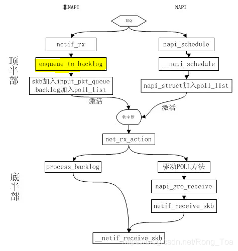

# NAPI： 新一代网络适配器的架构

- [NAPI： 新一代网络适配器的架构](#napi-新一代网络适配器的架构)
  - [特性及优势](#特性及优势)
  - [需求](#需求)
  - [工作过程](#工作过程)
    - [非NAPI帧的接收](#非napi帧的接收)
    - [NAPI方式帧的接收](#napi方式帧的接收)
    - [下半部分(net\_rx\_action)处理过程](#下半部分net_rx_action处理过程)
    - [Softirq 收包预算：netdev\_budget 和 netdev\_budget\_usecs](#softirq-收包预算netdev_budget-和-netdev_budget_usecs)
    - [下半部分的抢占](#下半部分的抢占)
    - [time\_squeeze 计数：ringbuffer 还有包，但 softirq 预算用完了](#time_squeeze-计数ringbuffer-还有包但-softirq-预算用完了)
    - [napi\_gro\_receive: GRO（Generic Receive Offloading）](#napi_gro_receive-grogeneric-receive-offloading)
  - [数据结构](#数据结构)
    - [接口](#接口)
  - [初始化](#初始化)
  - [Reference](#reference)

内核在2.6中引入了NAPI机制, 混合中断和轮询的方式来收包， 降低过多硬件网卡中断带来的CPU切换。
如果每个数据包大小等于MTU大小1460字节，当网卡以千兆网速收包时，CPU将每秒被中断91829次，万兆则为100万次。NAPI就是混合中断和轮询的方式来收包，当有中断来了，驱动关闭中断，通知内核收包，内核软中断轮询当前网卡，在规定时间尽可能多的收包。时间用尽或者没有数据可收，内核再次开启中断，准备下一次收包。

## 特性及优势

优点：

1. 中断缓和 (Interrupt mitigation)，在高流量下，网卡产生的中断可能达到每秒几千次，而如果每次中断都需要系统来处理，是一个很大的压力，而 NAPI 使用轮询时是禁止了网卡的接收中断的，这样会减小系统处理中断的压力；
2. 数据包节流 (Packet throttling)，NAPI 之前的 Linux NIC 驱动总在接收到数据包之后产生一个 IRQ，接着在中断服务例程里将这个 skb 加入本地的 softnet，然后触发本地 NET_RX_SOFTIRQ 软中断后续处理。如果包速过高，因为 IRQ 的优先级高于 SoftIRQ，导致系统的大部分资源都在响应中断，但 softnet 的队列大小有限，接收到的超额数据包也只能丢掉，所以这时这个模型是在用宝贵的系统资源做无用功。而 NAPI 则在这样的情况下，直接把包丢掉，不会继续将需要丢掉的数据包扔给内核去处理，这样，网卡将需要丢掉的数据包尽可能的早丢弃掉，内核将不可见需要丢掉的数据包，这样也减少了内核的压力。

## 需求

1. 设备需要有足够的缓冲区，保存多个数据分组。要使用 DMA 的环形输入队列（也就是 ring_dma，这个在 2.4 驱动中关于 Ethernet 的部分有详细的介绍），或者是有足够的内存空间缓存驱动获得的包。
2. 可以禁用当前设备中断，然而不影响其他的操作。在发送/接收数据包产生中断的时候有能力关断 NIC 中断的事件处理，并且在关断 NIC 以后，并不影响数据包接收到网络设备的环形缓冲区（以下简称 rx-ring）处理队列中。
3. IRQ 合并技术，用于减少 IRQ 数量，提升整体吞吐
4. ISR（Interrupt Service Routines - 中断服务程序）上下文之外使用轮询的方式来一次性接收多个数据包（VPP了解一下）
5. DMA
6. msix机制及初始化：OS在初始化配置区的时候, 会根据卡将pci卡的msix起始地址写到pci配置的扩展能力区域, 驱动只需要去读取对应的区域, 像os申请msix向量, 即可使用msix中断是一种特殊的中断, 不需要中断线, 但需要PCIE具备msix能力, 主机也必须支持apic才可. 当系统初始化时, 同时初始化主机上2个特殊硬件, IOAPIC和LocalAPIC, 在内存虚拟地址中开辟一段内存, 给每个cpu分配中断向量. 后面只要往这个内存上写触发设备信息, 那么就会被内存控制器劫持, 内存控制立即明白这是有外设触发了中断, 通知ioapic发送广播, 当对应的cpu判断对应的向量, 知道这个是要被自己处理, 就会处理这个中断。
7. PCIE的配置空间初始化：PCIE卡都遵循一个标准, x86通过往2个内存地址读写就可以控制IO桥访问一个内部寄存器+一个地址偏移, 就可以读写PCI的配置空间, 操作系统实际上就是用这个机制, 判断卡位是否插上了卡, 卡是否合法, 以及写对应的配置区域(相当于初始化)；

## 工作过程

1. napi初始化过程：
2. 网卡驱动注册过程：
   1. 注册 pci id 表和驱动程序`pci_device_id`, `pci_driver`。
   2. pci驱动程序检测设备(pci_dev)(`pci_driver->probe()`)并加载网卡驱动： 启动pci设备；请求(requesting)内存范围和IO端口；设置DMA掩码；注册设备驱动支持的ethtool方法。
   3. 注册中断处理函数： `mlx5_irq_int_handler`。 中断的触发方式有： MSI-X，MSI和传统的interrupt。
   4. 创建netdev，注册ethtool方法`net_device_ops`。
   5. 在网卡open的时候，注册NAPI poll方法，打开网卡硬中断。
3. 硬中断过程：
   1. 网卡收到包，发起硬件中断。kernel根据ISR(Interrupt Service Routings - 中断服务程序)，调用网卡注册的网卡驱动。比如mellanox网卡的注册中断处理函数为`mlx5_irq_int_handler`。MSI-X 中断是比较推荐的方式，尤其是对于支持多队列的网卡。 因为每个 RX 队列有独立的 MSI-X 中断，因此可以被不同的 CPU 处理（通过 irqbalance 方式，或者修改/proc/irq/IRQ_NUMBER/smp_affinity）。后面会看到 ，处理中断的 CPU 也是随后处理这个包的 CPU。这样的话，从网卡硬件中断的层面就可 以设置让收到的包被不同的 CPU 处理。
   2. 在硬中断的处理函数(比如`mlx5_irq_int_handler`)中会进行网卡状态的准备工作，最终会调用`napi_schedule(*napi)`，把网卡napi挂在中断对应cpu全局变量`softnet_data`d的`poll_list`上，然后发出软中断`NET_RX_SOFTIRQ`。mellanox的网卡硬中断函数非常简单，只是通知通知链就退出了。由内核态的通知链处理网卡状态，最后调用`napi_schedule(*napi)`。
4. `NET_RX_SOFTIRQ`软中断会执行软中断处理函数 `net_rx_action`。这个软中断也是处理硬中断的CPU进行后续处理的。



### 非NAPI帧的接收

1. 在中断上下文（在接收数据帧时）中调用`netif_rx`函数，`netif_rx`函数将网卡中收到的数据包（包装在一个socket buffer中）放到系统中的接收队列中（input_pkt_queue）。
2. 调用`enqueue_to_backlog`放入CPU的全局队列`input_pkt_queue`, 前提是这个接收队列的长度没有大于`netdev_max_backlog`(skb_queue_len(&sd->input_pkt_queue) <= netdev_max_backlog) , 如果超过了就drop。这个参数和另外一些参数可以在/proc文件系统中看到（/proc/sys/net/core文件中，可以手动调整这个数值）。
3. 调用`____napi_schedule`函数，该函数把设备对应的`napi_struct`结构插入到`softnet_data`的`poll_list`链表尾部，然后唤醒软中断，这样在下次软中断得到处理时，中断下半部就会得到处理。

### NAPI方式帧的接收

1. 通过`napi_schedule_prep()`确认网卡是否可调度，已经在调度仲，是否禁止了napi pending。
2. 如果符合条件，就关闭当前设备的中断，调用__napi_schedule函数把设备假如到轮训列表，从而开启轮询模式。


### 下半部分(net_rx_action)处理过程

待被轮询的设备通过`netif_rx_schedule`函数将`net_device`结构体实例的指针加入到`poll_list`链表中。 在调用`net_rx_action`函数执行软中断`NET_RX_SOFTIRQ`时会遍历`poll_list`链表，然后调用每个设备的`poll()`函数将数据帧(ring buffer中数据)存放在socket buffers中并通知上层协议栈。

net_rx_action函数的执行步骤如下：

1. 回收当前处理器的`poll_list`链表的引用。
2. 将`jiffies`的值保存在`start_time`变量中。
3. 设置轮询的`budget`（预算，可处理的数据包数量）为netdev_budget变量的初始值（这个值可以通过 /proc/sys/net/core/netdev_budget来配置）
4. 轮询`poll_list`链表中的每个设备，直到你的`budget`用完，当你的运行时间还没有超过一个`jiffies`时:
    1. a) 如果`quantum`（配额）为正值则调用设备的`poll()`函数，否则将`weight`的值加到`quantum`中，将设备放回`poll_list`链表；
    2. a.1) 如果`poll()`函数返回一个非零值，将`weight`的值设置到`quantum`中然后将设备放回`poll_list`链表；
    3. a.2) 如果`poll()`函数返回零值，说明设备已经被移除poll_list链表（不再处于轮询状态）。

### Softirq 收包预算：netdev_budget 和 netdev_budget_usecs

这俩参数控制每次 softirq 线程的收包预算，

- budget：最多可以收包的数量
- time_limit：最长可以占用的 CPU 时间
这两个预算限制中，任何一个达到后都将导致退出本次 softirq 处理。二者的默认值：

```C
// net/core/dev.c
int netdev_budget __read_mostly = 300;
// Must be at least 2 jiffes to guarantee 1 jiffy timeout
unsigned int __read_mostly netdev_budget_usecs = 2 * USEC_PER_SEC / HZ; // 2000us
``

注意这些预算是每个 CPU 上所有 NAPI 实例共享的总预算。

另外，这两个变量都是 sysctl 配置项，可以按需调优：

```shell
$ sudo sysctl -a | grep netdev_budget
net.core.netdev_budget = 300            # 300 个包
net.core.netdev_budget_usecs = 2000     # 2ms
```

### 下半部分的抢占

`budget`的值和`net_device`结构体的指针会传递到`poll()`函数中。`poll()`函数应该根据数据帧的处理数量来减小`budget`的值。数据帧从网络设备的缓冲区中复制出来包装在socket buffers中，然后通过`netif_receive_skb`函数传递到协议栈中去。

抢占策略是依赖`budget`变量的配额机制实现的：poll()函数必须根据分配给设备的最大配额来决定可以传递多少个数据包给内核。 当配额使用完就不允许在传递数据包给内核了，应该轮询poll_list链表中的下一个设备了。因此poll()必须和减小budget的值一样根据数据帧的处理数量来减小quota的值。

如果驱动在用完了所有的quota之后还没有传递完队列中所有的数据包，poll()函数必须停止运行并返回一个非NULL值。
如果所有数据包都传递到了协议栈，驱动程序必须再次使能设备的中断并停止轮询，然后调用netif_rx_complete函数（它会将设备从poll_list链表去除），最后停止运行并返回零值给调用者（net_rx_action函数）。

net_device结构体中的另一个重要成员weight，它用于每次调用poll()函数时重置quota的值。 很明显weight的值必须被初始化为一个固定的正值。通常对于高速网卡这个值一般在16和32之间，对于千兆网卡来说这个值会大一点（通常时64）。
从`net_rx_action`函数的实现中我们可以看到当weight的值设置太大时，驱动使用的budget会超过quantum，此时会导致一个轮询周期的时间变长。


1. 当网络包到达网卡时，调用网卡的`dev->poll()`进行数据包的处理，会批量从 `ring buffer` 收包；在这个 poll 工作时，会尽量把所有待收的包都收完（budget 可以配置和调优）；在此期间内新到达网卡的包，也不会再触发 IRQ；
2. 不在这个调度周期内，收到的包会触发 IRQ，然后内核来启动 poll() 再收包.
3. IRQ 合并技术，用于减少 IRQ 数量，提升整体吞吐。
4. netif_rx_schedule(dev): Called by an IRQ handler to schedule a poll for device
5. netif_rx_schedule_prep(dev): puts the device in a state which allows for it to be added to the CPU polling list if it is up and running.
6. __netif_rx_schedule(dev): Add device to the poll list for this CPU; assuming that _prep above has already been called and returned 1.
7. netif_rx_reschedule(dev, undo): Called to reschedule polling for device specifically for some deficient hardware. Read Appendix 2 for more details.
8. netif_rx_complete(dev):  Remove interface from the CPU poll list: it must be in the poll list on current cpu. This primitive is called by dev->poll(), when it completes its work. The device cannot be out of poll list at this call, if it is then clearly it is a BUG().

### time_squeeze 计数：ringbuffer 还有包，但 softirq 预算用完了

`softnet_data.time_squeeze` 字段记录的是满足如下条件的次数： ring buffer 中还有包等待接收，但本次 softirq 的 budget 已经用完了。 这对理解网络处理的瓶颈至关重要。

需要说明的是，time_squeeze 在 softnet_data 的所有字段中是非常特殊的一个：

- 其他的一些计数，例如 xx_drop/xx_errors，会在多个地方更新，所以不能从计数增 加直接定位到是哪段代码或哪个逻辑导致的；
- time_squeeze 计数在内核中只有一个地方会更新（内核 5.10），就是上面看到的那行代码；所以如果看到监控中有 time_squeeze 升高， 那一定就是执行到了以上 budget 用完的逻辑。

另外，time_squeeze 升高并不一定表示系统有丢包，只是表示 softirq 的收包预算用完时，RX queue 中仍然有包等待处理。只要 RX queue 在下次 softirq 处理之前没有溢出，那就不会因为 time_squeeze 而导致丢包；但如果有持续且 大量的 time_squeeze，那确实有 RX queue 溢出导致丢包的可能，需要结合其他监控指标 来看。在这种情况下，调大 budget 参数是更合理的选择：与其让网卡频繁触发 IRQ->SoftIRQ 来收包，不如让 SoftIRQ 一次多执行一会，处理掉 RX queue 中尽量多的 包再返回，因为中断和线程切换开销也是很大的。


### napi_gro_receive: GRO（Generic Receive Offloading）

Large Receive Offloading (LRO) 是一个硬件优化，GRO 是 LRO 的一种软件实现。
GRO 是一种较老的硬件特性（LRO）的软件实现，功能是对分片的包进行重组然后交给更上层，以提高吞吐。 GRO 给协议栈提供了一次将包交给网络协议栈之前，对其检查校验和 、修改协议头和发送应答包（ACK packets）的机会。

1. 如果 GRO 的 buffer 相比于包太小了，它可能会选择什么都不做；
2. 如果当前包属于某个更大包的一个分片，调用 enqueue_backlog() 将这个分片放到某个 CPU 的包队列；当包重组完成后，会交会协议栈网上送；3. 
3. 如果当前包不是分片包，往上送。

LRO 和 GRO 的主要思想都是通过合并“足够类似”的包来减少传送给网络栈的包数，这有 助于减少 CPU 的使用量。例如，考虑大文件传输的场景，包的数量非常多，大部分包都是一 段文件数据。相比于每次都将小包送到网络栈，可以将收到的小包合并成一个很大的包再送 到网络栈。GRO 使协议层只需处理一个 header，而将包含大量数据的整个大包送到用户程序。

这类优化方式的缺点是信息丢失：包的 `option` 或者 `flag` 信息在合并时会丢失。这也是为什么大部分人不使用或不推荐使用 LRO 的原因。LRO 的实现，一般来说，对 合并包的规则非常宽松。GRO 是 LRO 的软件实现，但是对于包合并的规则更严苛。

顺便说一下，如果用 tcpdump 抓包，有时会看到机器收到了看起来不现实的、非常大的包， 这很可能是你的系统开启了 GRO；后面会看到，tcpdump 的抓包点（捕获包的 tap）在整个栈的更后面一些，在 GRO 之后。

## 数据结构

```C
//include/linux/netdevice.h
struct softnet_data {
    struct list_head    poll_list;  // 对于支持NAPI的网卡，硬中断上下文将驱动对应的napi_struct结构挂载在这里，通过软中断进入驱动ndo_poll函数处理。
    struct sk_buff_head    process_queue;  // 对于不支持NAPI网卡，接收到skb放在input_pkt_queue, 处理中的数据包在process_queue中。

    /* stats */
    unsigned int        processed;
    unsigned int        time_squeeze;
    unsigned int        received_rps;
    struct softnet_data    *rps_ipi_list;
    struct sd_flow_limit __rcu *flow_limit;

    struct Qdisc        *output_queue;
    struct Qdisc        **output_queue_tailp;
    struct sk_buff        *completion_queue;
    struct sk_buff_head    xfrm_backlog;

    /* written and read only by owning cpu: */
    struct {
        u16 recursion;
        u8  more;
        u8  skip_txqueue;
    } xmit;

    /* input_queue_head should be written by cpu owning this struct,
     * and only read by other cpus. Worth using a cache line.
     */
    unsigned int    input_queue_head ____cacheline_aligned_in_smp;
    /* Elements below can be accessed between CPUs for RPS/RFS */
    call_single_data_t    csd ____cacheline_aligned_in_smp;
    struct softnet_data    *rps_ipi_next;
    unsigned int        cpu;
    unsigned int        input_queue_tail;
    unsigned int        dropped;
    struct sk_buff_head    input_pkt_queue; // 对于不支持NAPI的网卡，接受到的skb放在这个列表中。
    struct napi_struct    backlog;   // 对于不支持NAPI的网卡驱动，虚拟一个NAPI进行支持。
    /* Another possibly contended cache line */
    spinlock_t        defer_lock ____cacheline_aligned_in_smp;
    int            defer_count;
    int            defer_ipi_scheduled;
    struct sk_buff        *defer_list;
    call_single_data_t    defer_csd;
};
```

1. 每个CPU有维护一个`softnet_data`结构，维护轮询设备链表。NAPI设备均对应一个`napi_struct`结构，添加到`poll_list`链表中；非NAPI没有对应的`napi_struct`结构，为了使用NAPI的处理流程，使用了`softnet_data`结构中的`back_log`作为一个虚拟设备添加到轮询链表。
   1. `poll_list`字段，连接所有的轮询设备;
   2. `input_pkt_queue`由于非NAPI设备没有各自的接收队列，所以利用了softnet_data结构的`input_pkt_queue`作为全局的接收队列。
   3. `process_queue`队列做中转，相当于`input_pkt_queue`队列负责接收，`process_queue`队列负责处理
   4. `struct napi_struct backlog`，代表一个虚拟设备供轮询使用。
2. `struct napi_struct`是内核处理软中断的入口，每个`net_device`都对应一个`napi_struct`，驱动在硬中断中将自己的`napi_struct`挂载到CPU的收包队列`softnet_data`。内核在软中断中轮询该队列，并执行`napi_sturct`中的回调函数`int(*poll)(struct napi_struct *, int)`, 在poll函数中，驱动将网卡数据转换成skb_buff形式，最终发往协议栈。

```C
//include/linux/netdevice.h
struct napi_struct {
    struct list_head    poll_list;
    unsigned long        state;   //设备状态
    int weight;                   //每次轮询最大处理数据包数量
    int defer_hard_irqs_count;
    unsigned long   gro_bitmask;
    int            (*poll)(struct napi_struct *, int); //轮询设备的回调函数
    int            poll_owner;
    struct net_device    *dev;
    struct gro_list        gro_hash[GRO_HASH_BUCKETS];
    struct sk_buff        *skb;
    struct list_head    rx_list; /* Pending GRO_NORMAL skbs */
    int            rx_count; /* length of rx_list */
    struct hrtimer        timer;
    struct list_head    dev_list;
    struct hlist_node    napi_hash_node;
    unsigned int        napi_id;
    struct task_struct    *thread;
};
```

### 接口

1. `netif_napi_add`函数 - 驱动初始化时向内核注册软软中断处理回调`poll`函数。驱动在初始化`net_device`时通过这函数将通过这个函数绑定一个`napi_struct`结构。驱动需要在这里注册软中断中用于轮询的网卡的`poll`函数。
2. `__napi_schedule`函数 - 网卡硬件中断用来触发软中断，为驱动硬件中断提供的接口，驱动在硬件中断中，将自己的`napi_struct`挂载到当前CPU的`softnet_data`的`poll_list`上，随后发出软中断。
3. `napi_schedule_prep`函数 - 是上面`__napi_schedule`的配套函数，用于`__napi_schedule`调用前对`napi_struct`进行检查。判断NAPI是否可以调度。如果NAPI没有被禁止，且不存在已被调度的NAPI，则允许调度NAPI，因为同一时刻只允许有一个NAPI poll instance。测试napi.state字段，只有当其不是NAPI_STATE_SCHED时，返回真，并设置为NAPI_STATE_SCHED.
4. `napi_poll`函数 - 用于调用收包`poll`函数，这函数是被软中断处理函数`net_rx_action`调用的。这个函数将在`napi_struct.weight`规定的时间内，被`net_rx_action`循环调用，直到时间片用尽或者网卡当前DMA中所有缓存的数据包被处理完。如果是由于时间片用尽而退出的的话，`napi_struct`会重新挂载到`softnet_data`上，而如果是所有数据包处理完退出的，`napi_struct`会从`softnet_data`上移除并重新打开网卡硬件中断。
5. `napi_gro_receive`函数 - poll函数用来将网卡上的数据包发给协议栈处理，准确来说`napi_gro_receive`函数是驱动通过`poll`注册，内核调用的函数。通过这函数的的调用，skb将会传给协议栈的入口函数`__netif_receive_skb`。`dev_gro_receive`函数用于对数据包的合并，他将合并napi_struct.gro_list链表上的skb。GRO是一个网络子系统的另一套机制
6. `napi_complete`： 
7. `napi_complete_done`
8. `napi_schedule_irqoff`: 
9. `napi_schedule`: napi没有运行的时候，调度napi poll运行， 实际调用了`__napi_schedule`。

```C
    NAPI_STATE_SCHED,   /* Poll is scheduled */
    NAPI_STATE_MISSED,  /* reschedule a napi */
    NAPI_STATE_DISABLE, /* Disable pending */
    NAPI_STATE_NPSVC,   /* Netpoll - don't dequeue from poll_list */
    NAPI_STATE_LISTED,  /* NAPI added to system lists */
    NAPI_STATE_NO_BUSY_POLL,    /* Do not add in napi_hash, no busy polling */
    NAPI_STATE_IN_BUSY_POLL,    /* sk_busy_loop() owns this NAPI */
    NAPI_STATE_PREFER_BUSY_POLL,    /* prefer busy-polling over softirq processing*/
    NAPI_STATE_THREADED,    /* The poll is performed inside its own thread*/
    NAPI_STATE_SCHED_THREADED,  /* Napi is currently scheduled in threaded mode */
```

## 初始化

## Reference

1. [ref1](https://blog.csdn.net/Rong_Toa/article/details/109401935)
2. [ref2](https://arthurchiao.art/blog/linux-net-stack-implementation-rx-zh)
