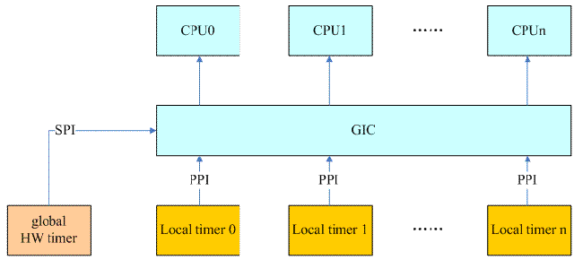

- [工作原理](#工作原理)
  - [ARM下的时钟框架](#arm下的时钟框架)
  - [在硬件提供系统级别的HW timer的情况下，tick broadcast如何运作？](#在硬件提供系统级别的hw-timer的情况下tick-broadcast如何运作)
  - [hrtimer based tick broadcast如何运作？](#hrtimer-based-tick-broadcast如何运作)
- [数据结构](#数据结构)
- [初始化](#初始化)
  - [Bootstrap CPU上的local timer的过程](#bootstrap-cpu上的local-timer的过程)
    - [注册clock event device的时候，和broadcast tick device相关的操作](#注册clock-event-device的时候和broadcast-tick-device相关的操作)
    - [BSP的per cpu的tick device的初始化](#bsp的per-cpu的tick-device的初始化)
  - [SOC timer的初始化过程](#soc-timer的初始化过程)
    - [如何安装/替换一个broadcast tick device？](#如何安装替换一个broadcast-tick-device)
    - [SOC timer的初始化后的系统状态](#soc-timer的初始化后的系统状态)
    - [Secondary CPU上的local timer的初始化过程](#secondary-cpu上的local-timer的初始化过程)
- [处于周期性tick模式下的broadcast tick device如何工作](#处于周期性tick模式下的broadcast-tick-device如何工作)
  - [1、系统何时处于周期性tick模式下呢？](#1系统何时处于周期性tick模式下呢)
  - [2、启动broadcast tick](#2启动broadcast-tick)
  - [3、设定broadcast tick device工作在周期性tick模式](#3设定broadcast-tick-device工作在周期性tick模式)
  - [4、broadcast tick device如何分发tick event到各个cpu core](#4broadcast-tick-device如何分发tick-event到各个cpu-core)
- [系统切换切换到one shot mode](#系统切换切换到one-shot-mode)
  - [1、per cpu tick device切换到one shot mode](#1per-cpu-tick-device切换到one-shot-mode)
  - [2、broadcast  tick device切换到one shot mode](#2broadcast--tick-device切换到one-shot-mode)
- [处于one shot模式下的broadcast tick device如何工作](#处于one-shot模式下的broadcast-tick-device如何工作)
  - [1、各个CPU进入/退出idle时候的处理](#1各个cpu进入退出idle时候的处理)
  - [2、broadcast tick device如何分发tick event到各个cpu core](#2broadcast-tick-device如何分发tick-event到各个cpu-core)

# 工作原理
在内核中，有cpuidle framework可以控制cpu的节电：当没有进程调度到该cpu上执行的时候，swapper进程粉墨登场，将该cpu会被推入到idle状态。当然CPU的idle状态有深有浅，当CPU睡的比较深入的时候，有可能会关闭本地的timer硬件。这样就会引入一个很有意思的问题：local timer将无法唤醒CPU，该cpu上的所有的software timer将无法唤醒cpu。tick broadcast framework就是用来解决这个问题的。

## ARM下的时钟框架
在ARM的multi core的架构下，每个cpu core都有可能调度到idle进程（id＝0的那个进程，又叫做swapper进程）从而使得cpu core进入idle状态，如果这时候该cpu core的local timer由于cpu core进入idle而被停掉，那么该cpu core上的所有的软件timer将不能正常运作，为了维持software timer的功能，我们可以考虑下面的方法：

1. 使用一个系统级别的HW timer（和cpuidle事件独立，不受其影响，always-on的，不属于任何一个CPU，如果使用GIC的话，那么该SOC timer的中断会使用SPI类型的中断，local timer都是使用PPI中断）来通知cpu醒来，处理software timer。
2. 如果没有系统级别的HW timer，那么可以考虑选择某个CPU CORE的local timer作为唤醒源（通过IPI唤醒其他处于idle状态的CPU core）。当然，这样选择会导致该cpu无法进入idle mode，从而影响了power saving。

## 在硬件提供系统级别的HW timer的情况下，tick broadcast如何运作？

我们假设系统的HW timer包括：ARM generic timer和一个SOC的HW timer。系统初始化的时候，这些driver都会初始化并注册`clockevent device`，毫无疑问，各个cpu core的local timer会建立一个`clockevent device`并成为该cpu core的per cpu tick device。SOC的HW timer对应的`clockevent device`当然被选择作为broadcast tick设备。在系统初始化的过程中，per cpu tick device会正常运作，而broadcast tick设备则不会，是否开始正常运作是看来自cpuidle framework的消息（其他cpu进入idle状态才会申请broadcast tick的服务）。

[cpuidle core](http://www.wowotech.net/pm_subsystem/cpuidle_core.html)文档中说到：cpuidle state中有一个叫做`CPUIDLE_FLAG_TIMER_STOP`的flag。当cpuidle driver的idle state中（可能会支持多个state）有一个state设置了这个flag时，就启动setup broadcast tick过程。 `CPUIDLE_FLAG_TIMER_STOP`说明CPU core在进入该idle state时，会停掉该CPU的local timer，这时候local timer停止运作，无法驱动software timer，需要broadcast tick device的协助。

因此，在cpuidle framework初始化的时候，会根据情况，在每个cpu core上执行发送`CLOCK_EVT_NOTIFY_BROADCAST_ON` message到时间子系统的clock event模块，通过这样的消息，告知broadcast tick模块，该cpu需要broadcast tick模块的服务。当然，这时候并不需要立刻启动向该cpu 发送tick的过程，毕竟这只是通知broadcast tick模块有客户需要它而已。在某CPU Core真正要进入一个标记有`CPUIDLE_FLAG_TIMER_STOP`的flag的cpuidle state的时候，会发送`CLOCK_EVT_NOTIFY_BROADCAST_ENTER`消息，告知broadcast tick模块：我的local timer要挂掉了，请求broadcast tick支援。

OK，上面只是描述了来自cpuidle framework的一些请求，但是tick broadcast framework如何处理呢？我们用下面的block diagram来描述：


我们先看看来自各个cpu的请求。实际上来自cpu的请求可以这样表述：我马上就要idle了，local timer要挂掉，请在A时间后唤醒我，当然，这里的A时间就是该cpu的timer list中最近的那个。同样的，其他的cpu也会进入idle状态，也会申请B时间，C时间…。broadcast tick就一个，只能是设定一个trigger的next event时间点，它考量的因素包括：

1. broadcast tick当前设定的next event的触发时间点
2. 各个cpu申请的时间点

我们假设当前时间点是X秒，broadcast tick当前设定的next event的触发时间点是X＋5秒，如果cpu申请的时间晚于当前设定的时间，例如X＋7秒，那么什么也不需要做，保持当前的设定，如果cpu申请的时间早于当前设定的时间，例如X＋3秒，那么broadcast tick会立刻修改next event的触发时间点为X＋3秒，以便满足3秒后唤醒该cpu的需求（当然，这时候一定要设定irq affinity，将该全局timer的中断定向到该CPU CORE）。根据上面的描述，似乎两个场景中总有一个被忽略，要么是cpu的申请（cpu申请的时间晚于当前设定的时间），要么是上一次某个cpu的申请（cpu申请的时间早于当前设定的时间）。实际上，tick broadcast framework不会忽略每个客户的请求的，那些会在broadcast tick event处理函数中遍历申请服务cpu的next event，找到最近要触发的那个时间点进行设定。

一旦broadcast tick 到来了，系统如何处理呢？主要进行两件事：

1. scan所有的申请中的那些cpu的timer list，找最近要触发的那个timer的超期时间并设定到broadcast tick 对应的那个全局HW timer中。
2. 针对每一个申请服务的cpu，将tick事件广播到该cpu去。需要注意的是：并不是仅仅将event送达一个cpu（该cpu的next event被设定到broadcast tick中），而是遍历所有申请服务的cpu，比对其next event和当前时间，以便确定是否要广播tick事件到该cpu。因为如果两个cpu的next event很近，一次性处理多个cpu的tick广播是更合理的选择。

## hrtimer based tick broadcast如何运作？
理想的状态当然是上节中描述的那样，然而现实中总有不如意的地方，如果没有系统级别的HW timer肿么办？你可能会觉得：那就不用吧，有什么了不起，不就是功耗有点损失嘛（cpu无法进入深层次的idle），我忍。不过实际上没有那么简单，我们一起来看看这种情况下per cpu tick的运作。我们都知道，在系统初始化过程中，基于local timer的per cpu tick总是从periodic mode开始工作，然后在softirq中周期性的检测是否切换到one shot mode（以便可以真正实现高精度timer），这个检查是`tick_check_oneshot_change`函数实现的，其中会调用`tick_is_oneshot_available`函数来检查per cpu的tick device是否适合进入one shot mode：
```C
int tick_is_oneshot_available(void)
{
    struct clock_event_device *dev = __this_cpu_read(tick_cpu_device.evtdev);

    if (!dev || !(dev->features & CLOCK_EVT_FEAT_ONESHOT))
        return 0;
    if (!(dev->features & CLOCK_EVT_FEAT_C3STOP))
        return 1;
    return tick_broadcast_oneshot_available();
}
```

在我们这个场景下，local timer对应的`clock event device`的flag应该是有one shot的能力，但是有C3STOP的特点，这时候，是否切入one shot模式完全依赖broadcast tick device是否有one shot的能力。如果你因为没有全局的HW timer而放弃构建broadcast tick设备，那么tick_is_oneshot_available函数无情的返回了false，从而阻止了各个cpu上的tick device进入one shot mode。

因此，有必要构建一个基于软件timer的broadcast tick device，这也就是传说中的hrtimer based tick broadcast，在linux/kernel/time/tick-broadcast-hrtimer.c文件中实现。本质上，这种方法是让其中一个cpu不进入idle，让该cpu上的一个hrtimer（基于local timer的）来模拟了全局的HW timer的硬件。当然这种方法也是有坏处的：

1. local timer无法直接将中断送达指定CPU CORE，只能通过IPI的中断
2. 在支持cpu hotplug的情况下，broadcast tick device有可能需要切换cpu，引入软件复杂性

Anyway，有总比没有强，牺牲了一个cpu（不能idle），幸福了其他cpu（可以进入idle）。具体hrtimer based tick broadcast的代码逻辑（linux/kernel/time/tick-broadcast-hrtimer.c）不会在本文中描述，大家自行修炼吧。

# 数据结构
- static struct tick_device tick_broadcast_device: 全局唯一负责广播的tick_device, `lapic`在c3-state会休眠。随着系统的初始化（或者支持hotplug HW timer插入系统），会有各种clock event device注册到系统中，tick broadcast framework会选择合适的clock event device作为向各个cpu core广播tick的那个tick device。
- static int tick_broadcast_forced： 这是一个强制使用broadcast tick device（而不使用per cpu的tick device）的一个控制变量，主要用于x86平台，这里就不详细描述了，有兴趣的读者可以访问[http://lwn.net/Articles/286432/](http://lwn.net/Articles/286432/) 了解更多的信息。
- static cpumask_var_t tick_broadcast_mask： tick_broadcast_mask中的每个bit标识该cpu core是否需要broadcast tick device的tick广播服务，如果需要，对应的bit被置位。
- static cpumask_var_t tick_broadcast_on： 这个变量和per cpu tick device中的具体的HW timer特性无关，是收集来自cpuidle framework的信息，也就是说来自cpu core的信息。如果cpu core发现自己在进入某些cpuidle state的时候会关闭local timer，那么就会设定相应的bit。在旧的kernel中，只有一个tick_broadcast_mask的变量，然而引入dummy timer的时候，导致了tick broadcast framework在某个特定的场景下会有issue，因此tick broadcast framework增加了控制逻辑（多了tick_broadcast_on这个变量），以便让系统在任何情况下都可以正常工作。了解更详细的信息，请参考[https://lkml.org/lkml/2013/7/2/272](https://lkml.org/lkml/2013/7/2/272)
- static cpumask_var_t tmpmask
- static cpumask_var_t tick_broadcast_oneshot_mask： tick_broadcast_oneshot_mask和tick_broadcast_mask类似，不同的是tick_broadcast_mask用在周期性tick的场景下，而tick_broadcast_oneshot_mask用于one shot mode的场景。
- static cpumask_var_t tick_broadcast_pending_mask
- static cpumask_var_t tick_broadcast_force_mask
- static DEFINE_PER_CPU(struct clock_event_device *, tick_oneshot_wakeup_device)： 

# 初始化

假设系统使用了ARM generic timer和一个SOC级别的HW timer（block diagram在上文中已经给出）。为了简单，我们假定所有的timer都是支持one shot和periodic模式（设有CLOCK_EVT_FEAT_ONESHOT和CLOCK_EVT_FEAT_PERIODIC这两个flag），并且有C3STOP的问题。

clock event设备的注册顺序为：

1. Bootstrap CPU上的local timer进行clock event设备的注册
2. SOC级别的HW timer进行clock event设备的注册
3. 各个secondary CPU上的local timer进行clock event设备的注册

```C
=> tick_init()                                                 // 初始化 tick 系统
    => tick_broadcast_init()                                   // 只是初始化了全局变量
    => tick_nohz_init()                                        // 在start_kernel解析命令行参数的时候已经将tick_nohz_full_running = true
        |-> arch_irq_work_has_interrupt() // 是否支持self-IPI，不支持唤醒不了这个CPU，就不能no_hz_full模式
        |-> 如果当前cpu也被设置了full模式，需要去掉，自己不能休眠
        |-> context_tracking_cpu_set(cpu) // 让tracking subsystem忽略
```

## Bootstrap CPU上的local timer的过程

### 注册clock event device的时候，和broadcast tick device相关的操作
`tick_check_new_device` 在注册设备的时候会判断这个设备适不适合作为broadcast时钟。
```C
void tick_check_new_device(struct clock_event_device *newdev)
{
    struct clock_event_device *curdev;
    struct tick_device *td;
    int cpu;

    cpu = smp_processor_id();
    if (!cpumask_test_cpu(cpu, newdev->cpumask))－－－－－－－－－－－－－－－－－（1）
        goto out_bc;

    td = &per_cpu(tick_cpu_device, cpu);－－－－－－－－－－－－－－－－－－－－－－（2）
    curdev = td->evtdev;

    if (!tick_check_percpu(curdev, newdev, cpu))－－－－－－－－－－－－－－－－－－－（3）
        goto out_bc;

    if (!tick_check_preferred(curdev, newdev))－－－－－－－－－－－－－－－－－－－－（4）
        goto out_bc;

    if (!try_module_get(newdev->owner))
        return;

    if (tick_is_broadcast_device(curdev)) {－－－－－－－－－－－－－－－－－－－－－－（5）
        clockevents_shutdown(curdev);－－－这里shutdown了broad cast对应的那个clock event device，那么问题来了，什么时候打开呢？
        curdev = NULL;
    }
    clockevents_exchange_device(curdev, newdev);
    tick_setup_device(td, newdev, cpu, cpumask_of(cpu));
    if (newdev->features & CLOCK_EVT_FEAT_ONESHOT)
        tick_oneshot_notify(); －－－异步通知clock event layer，确保可以切换到one shot mode
    return;

out_bc:
    tick_install_broadcast_device(newdev);－－－－－－－－－－－－－－－－－－－－－（6）
}
```
1. tick device有两种，一种是per cpu的tick device，另外一种是broadcast device，并不附着在某个CPU上。到底这个新的clock event device要成为哪种tick device是由它自己的特性决定的（当然，也有可能不和任何的tick device形成关联）。如果新注册的clock event device的所服务的CPU就不包含当前的CPU（cpumask说明了一个clock event device的所服务CPU的bitmap），那么当然就不要惊动per cpu tick device的探测过程了，直接调用tick_install_broadcast_device函数看看是否broadcast tick device是否会收留它。
2. 想要入主per cpu的tick device也不是那么简单，还要和current进行斗争，td指向了该CPU core当前的per cpu tick device，该tick device对应的clock event device会和注册的这个新的clock event device进行能力比拼。
3. per cpu的tick device偏爱“专情”的clock event device。我们可以假设这样的一个场景：系统中有一个全局的timer，其中断可以送达任何一个CPU，因此可以服务任何一个cpu（cpu mask设定为全1），虽然这个全局timer通过的step （1）的考验（cpumask_test_cpu），但是，当前cpu的那个per cpu的tick device已经和local timer结合了，而且那个local timer对应的clockevent device只服务于本cpu（cpu mask只有一个被设定为1），那么毫无疑问，当前注册的这个全局timer对应的clock event device会被无情的goto out_bc。当然，也不是说这种全局HW timer一点机会都没有，如果该cpu没有current per cpu的tick device，那么也就勉为其难了。
4. per cpu的tick device偏爱“优秀”的clock event device。所谓“优秀”其实就是是否有one shot的能力？是否rating高？如果新注册的clock event device在和current的竞争中失败，那么请去broadcast tick device那里试一试。
5. OK，我们已经准备使用新注册的clock event device来代替当前CPU上per cpu的tick device使用的clock event device，但是，也有可能旧的那个clock event device一人分饰两角，即是当前CPU上per cpu的tick device，又是boradcast tick device，那么保持其和boradcast tick device关系。这样也就是意味着该clock event device仍然挂在active的clocke event device队列中。后续的代码和本文无关，因此就不再描述了。
6. step 1～4 就是为了区分后续的针对该tick device的动作，要么试图使用这个clock event device来更新broad cast tick device（step （6）），要么更新per cpu的tick device（step （5）），对于BSP，我们当然走step （5）了。

### BSP的per cpu的tick device的初始化

```C
static void tick_setup_device(struct tick_device *td,
                  struct clock_event_device *newdev, int cpu,
                  const struct cpumask *cpumask)
{……
        if (tick_device_uses_broadcast(newdev, cpu))
        return;

……
}
```

`tick_device_uses_broadcast`主要是检查当前per cpu tick device的HW timer的特性并确定是否要启用broadcast tick设备，具体的代码如下：
```C
int tick_device_uses_broadcast(struct clock_event_device *dev, int cpu)
{
    struct clock_event_device *bc = tick_broadcast_device.evtdev;
    unsigned long flags;
    int ret;

    raw_spin_lock_irqsave(&tick_broadcast_lock, flags); 
    if (!tick_device_is_functional(dev)) {－－－－－－－－－－－－－－－－－－－－－－－－－（1）
        ……
    } else {－－－－ARM平台上都是进入这个分支
        if (!(dev->features & CLOCK_EVT_FEAT_C3STOP))－－－－－－－－－－－－－－－－（2）
            cpumask_clear_cpu(cpu, tick_broadcast_mask);
        else
            tick_device_setup_broadcast_func(dev);

        if (!cpumask_test_cpu(cpu, tick_broadcast_on))－－－－－－－－－－－－－－－－－－（3）
            cpumask_clear_cpu(cpu, tick_broadcast_mask);

        switch (tick_broadcast_device.mode) {
        case TICKDEV_MODE_ONESHOT:   
            tick_broadcast_clear_oneshot(cpu);－－－－－－－－－－－－－－－－－－－－－－（4）
            ret = 0;
            break;

        case TICKDEV_MODE_PERIODIC: 
            if (cpumask_empty(tick_broadcast_mask) && bc) －－－－－－－－－－－－－－－（5）
                clockevents_shutdown(bc); 
            ret = cpumask_test_cpu(cpu, tick_broadcast_mask); －－－－－－－－－－－－－－（6）
            break;
        default: 
            ret = 0;
            break;
        }
    }
    raw_spin_unlock_irqrestore(&tick_broadcast_lock, flags);
    return ret;
}
```

1. 一个clock event device是否可以正常的提供产生tick功能是可以通过`CLOCK_EVT_FEAT_DUMMY` 这个feature flag来判断的，如果注册的clock event device有DUMMY的flag，则说明这个clock event device只是个摆设，不能拿来产生tick。目前linux kernel中的x86平台的apic local timer设定了这个flag，也就意味着该timer对应的clock event device不能做tick device，虽然per cpu的tick device中的clock event device指针指向了自己，但是我只是dummy设备，是个占位符而已，还是请broadcast tick设备来帮我产生tick吧。这时候，整个系统是工作在周期性tick的模式下，broadcast tick设备会周期性的产生tick，广播到各个CPU上。由于ARM平台中没有使用`CLOCK_EVT_FEAT_DUMMY`这个flag，我们这里就一带而过吧。
2. 如果该clock event device没有标注C3STOP的flag，说明在cpuidle的时候自己能搞定一切，不需麻烦broadcast tick设备，因此清除`tick_broadcast_mask`中的标记。否则，调用t`ick_device_setup_broadcast_func`函数设定broadcast callback函数（设定为tick_broadcast）。对于BSP的local timer，我们当然走这一个分支：
```C
static void tick_device_setup_broadcast_func(struct clock_event_device *dev)
{
    if (!dev->broadcast)
        dev->broadcast = tick_broadcast;
    if (!dev->broadcast) {
        dev->broadcast = err_broadcast;
    }
}
```
在这个函数中per cpu tick device对应的那个clock event device的broadcast callback函数被设定成`tick_broadcast`。clock event device的broadcast call back函数是用来广播clock event的，broadcast tick的clock event需要广播到其他一个或者多个cpu的时候，需要调用该函数进行具体的广播动作（具体通过IPI实现）。
3. `tick_broadcast_on`是cpuidle framework设定的标志，local timer初始化的时候，cpuidle driver应该还没有初始化，因此这里这里会clear tick_broadcast_mask这个标识。
4. 如果broadcast tick device已经处于one shot mode，那么reset broadcast tick模块和per cpu tick之间的状态信息（tick_broadcast_oneshot_mask和tick_broadcast_pending_mask）。为什么可以这么做呢？因为这是在per cpu tick device的初始化过程中，系统正在运行过程中。在这种情况下，tick_device_uses_broadcast函数返回0，表示让调用者继续初始化该clock event device。
5. 缺省状态下，broadcast tick device处于periodic mode。对应本场景，这时候broadcast tick device还没有初始化呢，因此不会执行clockevents_shutdown。
6. 对于BSP的per cpu的tick device，这里会返回0值，表示暂时不考虑使用broadcast tick device。返回tick_setup_device的现场，如果返回0值，则会继续进行周期性tick设备的初始化（调用tick_setup_periodic）

OK，自此，BSP上的local timer已经初始化并启动，工作在周期性tick状态下，即是BSP上的local tick，又是系统的global tick设备。当然，local timer有one shot能力，是否这时候会切换到one shot mode呢？在timer的softirq中会周期性的检测是否可以切换到oneshot mode，代码如下：
```C
int tick_check_oneshot_change(int allow_nohz)
{
    struct tick_sched *ts = this_cpu_ptr(&tick_cpu_sched);

    if (!test_and_clear_bit(0, &ts->check_clocks))－－－tick_check_new_device已经异步通知了，通过
        return 0;

    if (ts->nohz_mode != NOHZ_MODE_INACTIVE)－－－－－初始化的状态就是INACTIVE，通过
        return 0;

    if (!timekeeping_valid_for_hres() || !tick_is_oneshot_available())－－－不通过
        return 0;

    if (!allow_nohz)
        return 1;

    tick_nohz_switch_to_nohz();
    return 0;
}
```
虽然BSP 的local timer有one shot能力，但是由于是C3STOP的，因此还需要看broadcast tick是否有one shot的能力（tick_broadcast_oneshot_available），这时候，broadcast tick还没有初始化呢。因此BSP处于周期性tick的模式下，直到启动SOC timer的初始化。

## SOC timer的初始化过程
在进行SOC timer的初始化的过程中会调用注册clock event设备的接口，从而触发`tick_check_new_device`的调用，这里，由于BSP已经有了per cpu的tick device，而且比SOC timer专情，因此执行step （6）

### 如何安装/替换一个broadcast tick device？
在系统注册一个新的clockevent device的时候，会根据情况来更新tick device（包括per cpu和broadcast tick device）的clock event device。调用tick_install_broadcast_device函数可以安装/替换系统中broadcast tick device中的clock event device。
```C
void tick_install_broadcast_device(struct clock_event_device *dev)
{
    struct clock_event_device *cur = tick_broadcast_device.evtdev; --获取当前的broadcast tick device

    if (!tick_check_broadcast_device(cur, dev))－－－－－－－－－－－－－－（1）
        return;

    if (!try_module_get(dev->owner))－－－增加reference count
        return;

    clockevents_exchange_device(cur, dev);－－－－－－－－－－－－－－－（2）
    if (cur)
        cur->event_handler = clockevents_handle_noop;
    tick_broadcast_device.evtdev = dev;－－－－－－－－－－已经更新到新的clock event device了
    if (!cpumask_empty(tick_broadcast_mask))－－－－－－－－－－－－－－（3）
        tick_broadcast_start_periodic(dev);
    if (dev->features & CLOCK_EVT_FEAT_ONESHOT)－－－－－－－－－－－（4）
        tick_clock_notify();
}
```
1. 不是什么阿猫阿狗都可以称为broadcast tick device的，首先不能是CLOCK_EVT_FEAT_C3STOP，本来broadcast tick就是为了解决cpuidle的时候timer会停掉的问题，如果broad cast tick device所依赖的clock event device也是C3STOP的，那还搞什么搞的。其次，不能是CLOCK_EVT_FEAT_PERCPU，broadcast tick device必须有能力将clock event事件传递到系统中的任何一个CPU上，如果是percpu的，那么其能力范围仅仅限于本CPU，没有broadcast的能力。满足了这些条件就OK了吗？也不是，那些都是一些基本条件，如果当前系统中没有设定broadcast tick device（cur ==NULL），那么只要满足基本条件就OK了，但是，如果当前已经设定好了broadcast tick device，那么又要比较了。不只是per cpu的tick device偏爱“优秀”的clock event device，broadcast tick device也是嫌贫爱富的主，还是要看看one shot能力以及rating，大家有兴趣可以看看tick_check_broadcast_device代码。

对于SOC timer场景，这里当然可以通过检查，SOC timer不是C3STOP的，而且有能力把中断送达每一个cpu（需要中断控制器支持，如果使用GIC的话，当然是OK的）。

2. OK，需要用新的clock event device来替换旧的，因此需要将旧的clock event device（如果存在的话）从active 队列中摘除，并设定CLOCK_EVT_MODE_UNUSED状态，挂入released clockevent队列。对于新的clockevent device，需要设定为CLOCK_EVT_MODE_SHUTDOWN状态。

3. tick_broadcast_mask中记录了哪些cpu要使用broadcast tick device的周期性tick服务，只要有一个需要，那么我们就要启动broadcast tick device的运作，使之进入周期性tick的mode。当然，最开始的时候，tick_broadcast_mask等于0，因此这里不会调用tick_broadcast_start_periodic。

4. 如果作为broadcast tick设备的clock event device具备one shot能力，还要异步通知到各个CPU，因为per cpu tick device有可能工作在periodic mode，现在系统有了支持one shot的broadcast tick device，看看是否有机会让per cpu tick device也切换到one shot的状态。

### SOC timer的初始化后的系统状态

SOC timer的初始化是在BSP上执行的，这时候BSP的per cpu tick device已经OK，工作在周期性tick下，由于cpudile framework还没有初始化（实际BSP一直在执行，因此没有机会调度到idle进程），也就是没有机会使用broadcast tick device的服务，这时候，虽然已经安装了broadcast tick device，但其功能没有启动，不会有tick事件发生。

### Secondary CPU上的local timer的初始化过程
当Secondary CPU的状态变成online之后，就会启动该cpu上的local timer的初始化过程。当然，仍然是在注册clockevent device的过程中调用 tick_check_new_device来检查和哪个tick device结合。结果很明显，当然是走per cpu tick device初始化的那条路径。这个过程类似BSP，这里就不详述了。


# 处于周期性tick模式下的broadcast tick device如何工作
## 1、系统何时处于周期性tick模式下呢？

一个简单的场景就是per cpu tick device的clock event device是dummy device。我们来看看这种场景下，系统是如何运作的。我们首先看看在初始化per cpu tick device中的处理，在tick_device_uses_broadcast处理函数中有一段代码：
```C
if (!tick_device_is_functional(dev)) {
    dev->event_handler = tick_handle_periodic;
    tick_device_setup_broadcast_func(dev);
    cpumask_set_cpu(cpu, tick_broadcast_mask);
    if (tick_broadcast_device.mode == TICKDEV_MODE_PERIODIC)
        tick_broadcast_start_periodic(bc);
    else
        tick_broadcast_setup_oneshot(bc);
    ret = 1;－－－－－－如果是dummy device，不初始化per cpu tick
}
```
在per cpu tick device的clock event device是dummy device的情况下，percpu tick device工作在周期性tick模式下，其clock event device的event handler被设定为tick_handle_periodic，其broadcast callback函数被设定为tick_broadcast。为了告知broadcast tick device本cpu需要它的服务，因此需要设定tick_broadcast_mask中对应该cpu的那个bit。由于需要broadcast tick的服务，因此也会根据当前的broadcast tick device的模式设定其event handler。

由于per cpu的local timer是dummy device，因此实际上代码不初始化per cpu tick，这时候就需要启动broadcast tick device，来为各个cpu提供tick，具体参考tick_broadcast_start_periodic函数。

另外一个场景是各个cpu的local timer不是dummy device，但是有C3STOP的问题，这时候，在系统初始化的初期会运作在周期性tick的模式（percpu tick device处于周期性tick mode下，broadcast tick没有启动）。

## 2、启动broadcast tick
在上面描述的两个场景中，场景二的broadcast tick device并没有启动，那么什么时候会启动其运作呢？这和cpuidle framework相关了。在cpuidle framework没有初始化之前，各个cpu是不会进入idle状态的，因此，不需要考虑C3STOP的问题。我们来看看cpuidle framework初始化过程中引发的操作。

cpuidle framework初始化过程中，如果cpuidle state有CPUIDLE_FLAG_TIMER_STOP”的flag，那么就会向时间子系统发送CLOCK_EVT_NOTIFY_BROADCAST_ON的message，这时候会调用tick_broadcast_on_off函数：
```C
static void tick_do_broadcast_on_off(unsigned long *reason)
{
    struct clock_event_device *bc, *dev;
    struct tick_device *td;
    unsigned long flags;
    int cpu, bc_stopped;

    raw_spin_lock_irqsave(&tick_broadcast_lock, flags);

    cpu = smp_processor_id();
    td = &per_cpu(tick_cpu_device, cpu);
    dev = td->evtdev;
    bc = tick_broadcast_device.evtdev;


    if (!dev || !(dev->features & CLOCK_EVT_FEAT_C3STOP))－－－－－－－－－－－（1）
        goto out;

    if (!tick_device_is_functional(dev))－－－－－－－－－－－－－－－－－－－－－－（2）
        goto out;

    bc_stopped = cpumask_empty(tick_broadcast_mask);

    switch (*reason) {
    case CLOCK_EVT_NOTIFY_BROADCAST_ON:
    case CLOCK_EVT_NOTIFY_BROADCAST_FORCE:
        cpumask_set_cpu(cpu, tick_broadcast_on);
        if (!cpumask_test_and_set_cpu(cpu, tick_broadcast_mask)) {－－－－－－－－－（3）
            if (tick_broadcast_device.mode ==  TICKDEV_MODE_PERIODIC)
                clockevents_shutdown(dev);
        }
        if (*reason == CLOCK_EVT_NOTIFY_BROADCAST_FORCE)
            tick_broadcast_force = 1;
        break;
    case CLOCK_EVT_NOTIFY_BROADCAST_OFF:
        ……略过off的代码
    }

    if (cpumask_empty(tick_broadcast_mask)) {
        if (!bc_stopped)
            clockevents_shutdown(bc);－－－在OFF的时候看看是否有机会shutdown bc
    } else if (bc_stopped) {－－－－－－－－－－－－－－－－－－－－－－－－－－－－（4)
        if (tick_broadcast_device.mode == TICKDEV_MODE_PERIODIC)
            tick_broadcast_start_periodic(bc);－－－－－－－－－－－－－－－－－－－－（5)
        else
            tick_broadcast_setup_oneshot(bc);
    }
out:
    raw_spin_unlock_irqrestore(&tick_broadcast_lock, flags);
}
```
1. 没有本cpu的local timer没有C3STOP的问题，那么直接返回
2. 如果是dummy device，那么也直接返回。也就是说，在dummy device的情况下，虽然各个cpu在cpuidle framework初始化/注销的时候会发送BROADCAST_ON/BROADCAST_OFF的消息，不过实际上并不参与实际的控制，因为在per cpu tick device初始化的时候就已经启动了broadcast tick device工作在周期性tick的模式下，这里就不用多此一举了。
3. 设定tick_broadcast_on，同时也设定tick_broadcast_mask，由于后续会启动broadcast tick device产生周期性tick服务每一个cpu，因此会shutdown per cpu的clock event device。
4. 如果是首次初始化cpuidle framework（每个cpu都会执行一次），那么需要初始化broadcast tick
5. 根据broadcast tick device的mode进行相应的初始化。

如果系统处于周期性tick模式下，则各个percpu 的tick device对应的clock event device要么是dummy的，要么被停掉，这时候，broadcast tick device为各个cpu提供周期性tick。这时候，虽然各个cpu在进入/退出idle状态的时候会发送BROADCAST_ENTER/BROADCAST_EXIT或者BROADCAST_ON/BROADCAST_OFF的消息，不过实际上并不参与实际的控制（tick_broadcast_oneshot_control函数一开始检查就退出了）。

## 3、设定broadcast tick device工作在周期性tick模式
tick_setup_periodic这个函数在periodic tick中已经描述，不过那份文档忽略掉了broadcast device的内容，我们这里主要broadcast device角度来分析如何setup一个tick device工作在周期性tick的模式。
```C
void tick_setup_periodic(struct clock_event_device *dev, int broadcast)
{
    tick_set_periodic_handler(dev, broadcast); －－－－－－－－－－－－－－－－－－－（1）

    if (!tick_device_is_functional(dev))
        return;

    if ((dev->features & CLOCK_EVT_FEAT_PERIODIC) &&
        !tick_broadcast_oneshot_active()) {
        clockevents_set_mode(dev, CLOCK_EVT_MODE_PERIODIC);－－－－－－－－－（2）
    } else {
        …… 用one shot模拟周期性的tick
    }
}
```
1. 对于broadcast tick device，event handler被设定为tick_handle_periodic_broadcast
2. 如果broadcast tick device对于的clock event支持CLOCK_EVT_FEAT_PERIODIC（硬件支持periodic的设定），并且没有工作在one shot模式下，那么启动周期性tick模式。

## 4、broadcast tick device如何分发tick event到各个cpu core
全局HW timer如果触发了中断，会被调度到某个cpu上执行（这个HW timer硬件中断应该是SPI类型的，可以送达任何一个cpu，在周期性mode下，软件没有控制irq affinity，因该是按照缺省的策略投递irq），在timer的中断处理函数中会调用该clock event device的event handler，具体的函数是tick_handle_periodic_broadcast：
```C
static void tick_handle_periodic_broadcast(struct clock_event_device *dev)
{
    ktime_t next;

    raw_spin_lock(&tick_broadcast_lock);

    tick_do_periodic_broadcast();

    if (dev->mode == CLOCK_EVT_MODE_PERIODIC)
        goto unlock;

    …… 用one shot模拟周期性的tick，设定下一次触发的时间
unlock:
    raw_spin_unlock(&tick_broadcast_lock);
}
```
如果clock event device工作在periodic模式，那么处理很简单，否则（one shot模式）需要设定下一次触发的时间值，因此，最核心的处理是tick_do_periodic_broadcast，代码如下：
```C
static void tick_do_periodic_broadcast(void)
{
    cpumask_and(tmpmask, cpu_online_mask, tick_broadcast_mask);
    tick_do_broadcast(tmpmask);
}
```

cpu_online_mask记录了on line的cpu，tick_broadcast_mask记录了申请broad cast服务的cpu，因此只需要处理那些CPU处于online状态并且申请了broad cast服务的cpu。
```C
static void tick_do_broadcast(struct cpumask *mask)
{
    int cpu = smp_processor_id();
    struct tick_device *td;

    if (cpumask_test_cpu(cpu, mask)) {－－－－－－－－－－－－（1）
        cpumask_clear_cpu(cpu, mask);
        td = &per_cpu(tick_cpu_device, cpu);
        td->evtdev->event_handler(td->evtdev);
    }

    if (!cpumask_empty(mask)) {－－－－－－－－－－－－－－－（2）
        td = &per_cpu(tick_cpu_device, cpumask_first(mask));
        td->evtdev->broadcast(mask);
    }
}
```

1. 是否本cpu也需要broadcast tick 设备的服务，如果需要，那么直接调用本cpu对应的per cpu tick device的event handler。调用event handler也就意味着将tick事件广播到了本cpu。
2. 这是处理其他cpu的代码。有可能多个cpu（除了本cpu）需要broadcast tick 设备的服务，这时候，就需要调用clock event device对应的broadcast call back函数了（随便选择一个即可）。broadcast call back函数可以将tick广播到多个cpu上，具体如何做呢？当然是通过IPI机制的进行的（IPI_TIMER message），具体可以参考tick_broadcast的代码。
# 系统切换切换到one shot mode

## 1、per cpu tick device切换到one shot mode
我们又回到hrtimer_run_pending函数，每次timer的软中断中都会调用它：
```C
void hrtimer_run_pending(void)
{
    if (tick_check_oneshot_change(!hrtimer_is_hres_enabled()))
        hrtimer_switch_to_hres();
}
```
由于broadcast tick已经ready， `tick_check_oneshot_change`返回TRUE，因此会调用`hrtimer_switch_to_hres`函数，将系统的hrtimer切换到高精度状态。原来的系统的clock event设备工作在periodic mode下，无法实现真正的高精度timer，因此hrtimer模块委曲求全，工作在低精度模块下，现在系统可以one shot了，因此可以改变到高精度状态。

`hrtimer_switch_to_hres`函数会调用`tick_init_highres`，代码如下：
```C
int tick_init_highres(void)
{
    return tick_switch_to_oneshot(hrtimer_interrupt);
}

int tick_switch_to_oneshot(void (*handler)(struct clock_event_device *))
{
    切换per cpu tick device进入one shot mode
    tick_broadcast_switch_to_oneshot();
    return 0;
}
```
因此，一旦broadcast tick已经ready，所有的per cpu tick device都会依次切换到one shot mode。
## 2、broadcast  tick device切换到one shot mode

在per cpu tick device切换进入one shot mode之后，broadcast tick device也尾随而入：
```C
void tick_broadcast_switch_to_oneshot(void)
{
    struct clock_event_device *bc;
    unsigned long flags;

    raw_spin_lock_irqsave(&tick_broadcast_lock, flags);

    tick_broadcast_device.mode = TICKDEV_MODE_ONESHOT;
    bc = tick_broadcast_device.evtdev;
    if (bc)
        tick_broadcast_setup_oneshot(bc); －－－设定broadcast tick进入one shot状态

    raw_spin_unlock_irqrestore(&tick_broadcast_lock, flags);
}
```
上面的代码简单而且清晰，主要的逻辑在tick_broadcast_setup_oneshot中实现：
```C
void tick_broadcast_setup_oneshot(struct clock_event_device *bc)
{
    int cpu = smp_processor_id();

    if (bc->event_handler != tick_handle_oneshot_broadcast) { －－－－－－－－－－－－－（1）
        int was_periodic = bc->mode == CLOCK_EVT_MODE_PERIODIC;

        bc->event_handler = tick_handle_oneshot_broadcast; －－－设定one shot handler

        cpumask_copy(tmpmask, tick_broadcast_mask); －－－－－－－－－－－－－－－（2）
        cpumask_clear_cpu(cpu, tmpmask); －－－－－－－－－－－－－－－－－－－－－（3）
        cpumask_or(tick_broadcast_oneshot_mask,
               tick_broadcast_oneshot_mask, tmpmask); －－－－－－－－－－－－－－－－（4）

        if (was_periodic && !cpumask_empty(tmpmask)) { －－－－－－－－－－－－－－－（5）
            clockevents_set_mode(bc, CLOCK_EVT_MODE_ONESHOT);
            tick_broadcast_init_next_event(tmpmask, tick_next_period); －－－－－－－－－（6）
            tick_broadcast_set_event(bc, cpu, tick_next_period, 1); －－－－－－－－－－－（7）
        } else
            bc->next_event.tv64 = KTIME_MAX;
    } else { 
        tick_broadcast_clear_oneshot(cpu); －－－－－－－－－－－－－－－－－－－－－（8）
    }
}
```
1. 每次cpu在进行模式切换的时候都会调用该函数，当然，我们限制调用tick_broadcast_setup_oneshot函数进行一次切换就OK了。
2. 我们要非常小心的处理broadcast tick的模式切换，因为有可能这时候broadcast tick设备工作在周期性tick下，并且还在服务其他cpu呢。因此要保留那些周期性tick的需求。
3. 本cpu的周期性tick可以清掉，本cpu正在执行模式切换，不需broadcast tick的服务，当本cpu进入idle的时候会按照正常的流程来申请服务的。
4. 切换到one shot mode，代码逻辑所依赖的状态信息也就会切换到tick_broadcast_oneshot_mask，归并过去的需求到该变量上来。
5. 如果有残留的周期性tick服务需求，那么需要立刻启动该broadcast tick进入oneshot模式的工作状态，为那些还需要周期性tick的cpu提供可以正常运作的周期性tick。当这些tick送达到那些CPU后，在timer软中断上下文中会切换周期性mode到one shot mode。这时候，整个系统（各个cpu的tick以及broadcast tick）都是在one shot模式下工作。
6. 将需要周期性服务的那些cpu的next event设定为tick_next_period
7. 设定broadcast tick device在tick_next_period时间之后触发，站好周期性tick的最后一班岗。
8. 第一个切换到one shot mode的cpu处理比较复杂（上面的1～7步），对于其他的cpu而言，tick_broadcast_setup_oneshot比较简单，只要清掉one shot相关的mask就OK了。

# 处于one shot模式下的broadcast tick device如何工作
## 1、各个CPU进入/退出idle时候的处理
当系统中的某个CPU Core要进入/退出一个标记有“CPUIDLE_FLAG_TIMER_STOP”的flag的cpuidle state的时候，会发送CLOCK_EVT_NOTIFY_BROADCAST_ENTER/EXIT消息，告知broadcast tick模块：我的local timer要挂掉了，请求broadcast tick支援。ENTER/EXIT消息是发送到了clock event layer，在clockevents_notify中处理：
```C
int clockevents_notify(unsigned long reason, void *arg)
{……

    case CLOCK_EVT_NOTIFY_BROADCAST_ENTER:
    case CLOCK_EVT_NOTIFY_BROADCAST_EXIT:
        ret = tick_broadcast_oneshot_control(reason);
        break;

……
}
```
tick_broadcast_oneshot_control函数的代码如下：
```C
int tick_broadcast_oneshot_control(unsigned long reason)
{
    struct clock_event_device *bc, *dev;
    struct tick_device *td;
    unsigned long flags;
    ktime_t now;
    int cpu, ret = 0;

if (tick_broadcast_device.mode == TICKDEV_MODE_PERIODIC)－－－－－－－－－（1）
        return 0; 
    cpu = smp_processor_id();
    td = &per_cpu(tick_cpu_device, cpu);
    dev = td->evtdev;

    if (!(dev->features & CLOCK_EVT_FEAT_C3STOP))－－－－－－－－－－－－－－－（2）
        return 0;

    bc = tick_broadcast_device.evtdev;

    raw_spin_lock_irqsave(&tick_broadcast_lock, flags);
    if (reason == CLOCK_EVT_NOTIFY_BROADCAST_ENTER) {
        if (!cpumask_test_and_set_cpu(cpu, tick_broadcast_oneshot_mask)) {－－－－－－（3）
            WARN_ON_ONCE(cpumask_test_cpu(cpu, tick_broadcast_pending_mask));
            broadcast_shutdown_local(bc, dev);－－－shutdown local timer

            if (!cpumask_test_cpu(cpu, tick_broadcast_force_mask) &&
                dev->next_event.tv64 < bc->next_event.tv64)
                tick_broadcast_set_event(bc, cpu, dev->next_event, 1);－－－－－－－－－－－（4）
        }

        ret = broadcast_needs_cpu(bc, cpu); －－－和hrtimer broadcast相关
        if (ret)
            cpumask_clear_cpu(cpu, tick_broadcast_oneshot_mask);－－－－－－－－－－－（5）
    } else {
        if (cpumask_test_and_clear_cpu(cpu, tick_broadcast_oneshot_mask)) { －－－－－－（6）
            clockevents_set_mode(dev, CLOCK_EVT_MODE_ONESHOT); －－－－－－－－－（7）

             if (cpumask_test_and_clear_cpu(cpu, tick_broadcast_pending_mask))－－－－－－（8）
                goto out;


            if (dev->next_event.tv64 == KTIME_MAX)
                goto out;


            now = ktime_get(); －－－获取当前时间
            if (dev->next_event.tv64 <= now.tv64) { －－－－－－－－－－－－－－－－－－－－（9）
                cpumask_set_cpu(cpu, tick_broadcast_force_mask);
                goto out;
            } 
            tick_program_event(dev->next_event, 1); －－－－－－－－－－－－－－－－－－－（10）
        }
    }
out:
    raw_spin_unlock_irqrestore(&tick_broadcast_lock, flags);
    return ret;
}
```
1. broadcast tick device一般是不会工作在periodic mode下的，毕竟在这种状态下broadcast tick device是无法按照进入idle状态的cpu（local timer停掉）的需求提供tick。不过，如果per cpu tick的clock event设备是dummy的，也就是无法提供功能，那么这时候可以让broadcast tick device处于周期性模式，不断的为各个cpu提供周期性的tick。这时候，是否cpu进入idle状态是没有关系的（由于其per cpu的tick设备对应的clock event设备都是dummy的，broadcast tick device总是会周期性的传送tick事件），可以直接返回。此外，由于系统一开始总是从周期性模式开始，随着系统的运行会切换到one shot模式，不过这种场景下，周期性模式是一个暂态过程，系统最终还是会停留在one shot mode。
2. 如果percpu tickdevice对应的clock event device不是C3STOP的，那么也不需要额外的处理，直接返回。
3. 首先需要设定tick_broadcast_oneshot_mask这个标识位，以此告知broadcast tick framework该cpu需要broadcast tick模块的服务。此外，还检查之前的设定（这里使用的是cpumask_test_and_set_cpu）。为何要这么做呢？正常来说，tick_broadcast_oneshot_mask不都是随着cpu进入idle置位，退出idle清零吗？实际上这里主要是考虑从周期性模式到one shot模式切换中，这时候，broadcast tick device处于one shot mode，因此可以通过步骤1，而在第一个切换到one shot mode的cpu的代码执行中，会将tick_broadcast_mask复制到tick_broadcast_oneshot_mask中，如果tick_broadcast_oneshot_mask对应该cpu的bit等于1，说明该cpu的clockevent device已经shutdown（周期性tick mode下，per cpu的tick device都是shutdown的，都靠broadcast tick），不能提供tick，该cpu使用了broadcast tick device来提供周期性tick服务。因此，在这种情况下，不必shutdown per cpu的clockevent device了，也不必reprogram next event。

broadcast_shutdown_local函数用于shutdown local timer，当然，是否可以真正shutdown还要看看broadcast tick device是否有CLOCK_EVT_FEAT_HRTIMER特性，此外，如果在hrtimer based broadcast tick的情况下，如果本cpu就是用来提供broadcast tick服务的那个cpu，这时候也不能shutdown local timer。

4. 如果该cpu的next event比broadcast tick的next event还要小，那么用该cpu上的next event重新设定next trigger event。当然，这里还有一个特例就是tick_broadcast_force_mask，如果该cpu设置了force mask，则说明
5. 在hrtimer based tick broadcast的场景下，如果tick broadcast设备所依赖的那个hrtimer就是运行在当前的cpu上，那么该cpu是不会进入idle状态的，因此clear tick_broadcast_oneshot_mask（本cpu不会进入idle，其local timer就不会停掉，也就不需要tick broadcast的服务）。
6. 清除tick_broadcast_oneshot_mask这个标识位，告知broadcast tick framework，我已经不用你提供的tick服务了。
7. CPU从idle状态返回，local timer又活过来了，因此重新设定local timer工作在one shot mode
8. 我们假设一个场景：有三个cpu core分别是A、B、C，A的next event是最近的，因此SOC timer被设定为A的时间点并且SOC timer的中断被定向到A处理器，但是，实际上B和C的时间仅仅比A小了一点点，在A处理器上执行broad cast tick device的event handler的时候，发现B和C也已经到期了，需要处理（发送了IPI给B和C处理器），为了标识这种状态，B和C的tick_broadcast_pending_mask标识被置位了。

当然清掉tick_broadcast_pending_mask中的标志是必须要的，毕竟本cpu已经离开了idle状态，可以处理自己的clock event了，但是，在这里，就不适合再reprogramming next event了，毕竟这个next event已经超期，而且会在IPI的handler中处理。因此，当清除tick_broadcast_pending_mask的时候，检查发现该bit是pending的，那么就直接跳出，不需要后续的处理了

9. 当代码执行到这里，有两个场景：
- 场景一：SOC timer将中断送达本cpu，从而将该处理器唤醒，执行完成这里的代码，该处理器会调用broadcast tick device的event handler的。
- 场景二：其他的中断唤醒了该cpu

这时候，tick_broadcast_oneshot_mask已经被清除了，随后的tick_handle_oneshot_broadcast可是根据tick_broadcast_oneshot_mask进行处理的，因此，如果是场景一，我们必须有办法让后续的tick_handle_oneshot_broadcast来处理本cpu超期的clock event。这时候需要设定tick_broadcast_force_mask的标记，标了这个标记的cpu，tick_handle_oneshot_broadcast也会进行处理的。

如果是场景二，并且本cpu的clockevent对应的next time已经需要trigger了，怎么办？反正tick_handle_oneshot_broadcast也很快要执行了，那么就不再programming local timer了，还是设定force flag，让broadcast tick来处理吧。

10. 对于场景二，并且本cpu的next event的时间点还没有超期，这时候反正local timer以及ready（cpu 离开了idle状态），那么还是依靠自己的local timer吧。

## 2、broadcast tick device如何分发tick event到各个cpu core
当SOC timer（或者叫做全局timer）触发中断的时候，会将该中断送达set next event的那个cpu（tick_broadcast_set_event中会设定irq affinity），从而引发broadcast tick device对于的那个clock event设备的event handler的执行，代码如下：
```C
static void tick_handle_oneshot_broadcast(struct clock_event_device *dev)
{
    struct tick_device *td;
    ktime_t now, next_event;
    int cpu, next_cpu = 0;

    raw_spin_lock(&tick_broadcast_lock);
again:
    dev->next_event.tv64 = KTIME_MAX;
    next_event.tv64 = KTIME_MAX;
    cpumask_clear(tmpmask);
    now = ktime_get();
    
    for_each_cpu(cpu, tick_broadcast_oneshot_mask) {－－－－－－－－－－－－－－（1）
        td = &per_cpu(tick_cpu_device, cpu);
        if (td->evtdev->next_event.tv64 <= now.tv64) {－－－－－－－－－－－－－－－－（2）
            cpumask_set_cpu(cpu, tmpmask);
            cpumask_set_cpu(cpu, tick_broadcast_pending_mask); －－－－－－－－－－（3）
        } else if (td->evtdev->next_event.tv64 < next_event.tv64) { －－－－－－－－－－－（4）
            next_event.tv64 = td->evtdev->next_event.tv64;
            next_cpu = cpu;
        }
    }

    cpumask_clear_cpu(smp_processor_id(), tick_broadcast_pending_mask); －－－－－（5）

    cpumask_or(tmpmask, tmpmask, tick_broadcast_force_mask); －－－－－－－－－－（6）
    cpumask_clear(tick_broadcast_force_mask);


    if (WARN_ON_ONCE(!cpumask_subset(tmpmask, cpu_online_mask))) －－－－－－－（7）
        cpumask_and(tmpmask, tmpmask, cpu_online_mask);

    tick_do_broadcast(tmpmask); －－－－－唤醒那些需要服务而且时间到期的cpu们

    if (next_event.tv64 != KTIME_MAX) { 
        if (tick_broadcast_set_event(dev, next_cpu, next_event, 0)) －－－－－－－－－－－（8）
            goto again;
    }
    raw_spin_unlock(&tick_broadcast_lock);
}
```
1. tick_broadcast_oneshot_mask变量中，每个set的bit说明该cpu已经进入idle状态，需要broadcast tick device的服务。通过for_each_cpu来遍历每一个需要服务的cpu。
2. next_event就是该clock event device下次要触发的时间点，如果该时间点早于当前的时间点，说明需要alter该cpu了，因此调用cpumask_set_cpu设定tmpmask，后续会根据tmpmask来发送tick广播。从这里的代码可以看出，虽然broadcast tick设定的触发时间是所有cpu中最近的那个trigger timer，并把irq送达该cpu，但是实际上，并不是一次只将该tick送到设定next event的那个cpu，实际上会检查所有的cpu的next event，以便尽可能的一次多处理几个CPU上的clock event事件。
3. 设定tick_broadcast_pending_mask，告知该cpu：你的next event我已经处理，并且发送了IPI message，请在IPI handler中处理就OK了。这主要是为了避免在tick_broadcast_oneshot_control中reprogram local timer。
4. 如果不需要广播tick，唤醒该cpu，那么需要为下一次的唤醒时间做准备。我们会遍历所有的需要服务的cpu，比对其per cpu tick的next event，并把最近的那个触发时间点保存在next_event同时记录该cpu id为next_cpu。
5. 清除本cpu在tick_broadcast_pending_mask中的标志。为何要清本cpu的pending标志呢？因为随后就会在tick_do_broadcast中直接处理本cpu的event（直接调用event handler而不是发送IPI消息），这些代码都是在一个临界区内（tick_broadcast_lock），不会有其他分支插入了。
6. 除了正常的那些申请了服务并且到期的cpu需要被唤醒之外，还需要加上那些enforced broadcast requests。
7. 没有online的那些cpu就不考虑广播tick到该cpu了
8. 本次的broadcast tick device的event handler处理一部分到期的cpu们，但是，tick_broadcast_oneshot_mask中还有一些没有到期的cpu，我们需要为下一次做准备。因此这里会调用tick_broadcast_set_event用来设定next event时间点到broadcast tick device，如果设置失败，说明这些cpu中有些next event已经超期，因此需要重新执行本函数的逻辑，以便广播tick，唤醒那些到期的cpu。


ref: https://www.cnblogs.com/alantu2018/p/8448312.html