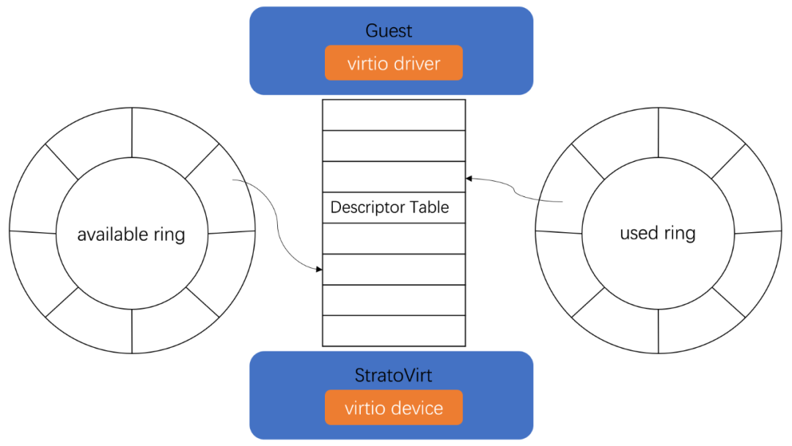
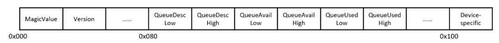
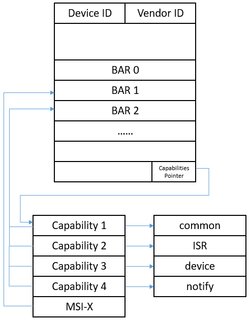

# VirtioDevice Trait
StratoVirt 的 virtio crate 提供了 virtio 设备的通用接口以及所有 virtio 设备的相关实现。其中，lib.rs 中定义了为所有 virtio 设备定义的 VirtioDevice Trait。每种 virtio 设备都需要实现自定义的 VirtioDevice 接口。
```rust
/// The trait for virtio device operations.
pub trait VirtioDevice: Send {
    /// Realize low level device.
    fn realize(&mut self) -> Result<()>;

    /// Unrealize low level device
    fn unrealize(&mut self) -> Result<()> {
        bail!("Unrealize of the virtio device is not implemented");
    }

    /// Get the virtio device type, refer to Virtio Spec.
    fn device_type(&self) -> u32;

    /// Get the count of virtio device queues.
    fn queue_num(&self) -> usize;

    /// Get the queue size of virtio device.
    fn queue_size(&self) -> u16;

    /// Get device features from host.
    fn get_device_features(&self, features_select: u32) -> u32;

    /// Set driver features by guest.
    fn set_driver_features(&mut self, page: u32, value: u32);

    /// Read data of config from guest.
    fn read_config(&self, offset: u64, data: &mut [u8]) -> Result<()>;

    /// Write data to config from guest.
    fn write_config(&mut self, offset: u64, data: &[u8]) -> Result<()>;

    /// Activate the virtio device, this function is called by vcpu thread when frontend
    /// virtio driver is ready and write `DRIVER_OK` to backend.
    ///
    /// # Arguments
    ///
    /// * `mem_space` - System mem.
    /// * `interrupt_evt` - The eventfd used to send interrupt to guest.
    /// * `interrupt_status` - The interrupt status present to guest.
    /// * `queues` - The virtio queues.
    /// * `queue_evts` - The notifier events from guest.
    fn activate(
        &mut self,
        mem_space: Arc<AddressSpace>,
        interrupt_cb: Arc<VirtioInterrupt>,
        queues: &[Arc<Mutex<Queue>>],
        queue_evts: Vec<EventFd>,
    ) -> Result<()>;

    /// Deactivate virtio device, this function remove event fd
    /// of device out of the event loop.
    fn deactivate(&mut self) -> Result<()> {
        bail!(
            "Reset this device is not supported, virtio dev type is {}",
            self.device_type()
        );
    }

    /// Reset virtio device.
    fn reset(&mut self) -> Result<()> {
        Ok(())
    }

    /// Update the low level config of MMIO device,
    /// for example: update the images file fd of virtio block device.
    ///
    /// # Arguments
    ///
    /// * `_file_path` - The related backend file path.
    fn update_config(&mut self, _dev_config: Option<Arc<dyn ConfigCheck>>) -> Result<()> {
        bail!("Unsupported to update configuration")
    }
}
```

- realize()/unrealize(): 这一组接口用于具现化/去具现化具体的 virtio 设备。具现化做的一些具体操作包括设置支持的 features、设备特有的属性（如网卡的 mac）、初始化连接 Host 后端设备等。
- set_driver_features()：将前端驱动支持的 features 与后端模拟设备支持的 features 进行协商后，设置最终实现的 features。
- read_config()/write_config()：virtio 协议规范为每种 virtio 设备定义了自定义的配置空间，这组接口就是用来读写这部分配置数据。
- activate()/deactivate(): 激活/去激活设备，负责绑定/解绑后端、加入/移除 I/O 循环。
- reset()：虚拟机重启时某些设备需要重置。
- update_config()：支持轻量机型下的 virtio-mmio 设备动态绑定/解绑后端，实现 virtio-mmio 设备的模拟热插拔。

# virtqueue

virtio 设备可以有一个或多个队列，每个队列有描述符表、available ring、used ring 三个部分。当前 StratoVirt 的 virtio 设备均遵循 1.0 规范，队列的内存布局仅支持 Split Vring 的方式。queue.rs 中定义了一系列针对队列操作及查询的接口。所有的 I/O 请求数据信息以描述符的形式存放在描述符表中，前端准备好数据后更新可用 ring 告诉后端还有哪些 I/O 待发送，后端执行完 I/O 更新 used ring 通知前端。不同设备的 I/O 处理不尽相同，但是核心的 virtqueue 操作是一样的。

```C
pub struct SplitVring {
    /// Region cache information.
    pub cache: Option<RegionCache>,
    /// Guest physical address of the descriptor table.
    /// The table is composed of descriptors(SplitVringDesc).
    pub desc_table: GuestAddress,

    /// Guest physical address of the available ring.
    /// The ring is composed of flags(u16), idx(u16), ring[size](u16) and used_event(u16).
    pub avail_ring: GuestAddress,

    /// Guest physical address of the used ring.
    /// The ring is composed of flags(u16), idx(u16), used_ring[size](UsedElem) and avail_event(u16).
    pub used_ring: GuestAddress,

    /// Host address cache.
    pub addr_cache: VirtioAddrCache,

    /// Indicate whether the queue configuration is finished.
    pub ready: bool,

    /// The maximal size in elements offered by the device.
    pub max_size: u16,

    /// The queue size set by frontend.
    pub size: u16,

    /// Interrupt vector index of the queue for msix
    pub vector: u16,

    /// The next index which can be popped in the available vring.
    next_avail: Wrapping<u16>,

    /// The next index which can be pushed in the used vring.
    next_used: Wrapping<u16>,

    /// The index of last descriptor used which has triggered interrupt.
    last_signal_used: Wrapping<u16>,
}
```

# virtio-mmio 设备
StratoVirt 目前提供两种机型：轻量机型和标准机型。轻量机型由于需要追求极致的启动速度以及内存底噪开销，因此只支持挂载数量有限的 virtio-mmio 设备。而标准机型面向传统的标准云化场景，对于 I/O 设备的性能要求较高，且需要支持热插拔满足资源弹性，因此标准机型支持将 virtio 设备以 PCI 设备挂载在模拟的 PCI 总线上。目前标准机型只支持配置 virtio-pci 设备，不支持 virtio-mmio 设备。

结构体 `VirtioMmioDevice` 定义了一个通用的 virtio-mmio 设备，其中的 device 即为实现了 VirtioDevice 这个 trait 的具体的 virtio 设备结构，可以是网卡、磁盘等。VirtioMmioState 结构体中存放了 virtio-mmio 设备的控制寄存器，并且为其实现了对应的读写接口 read_common_config（）/write_common_config（）。virtio-mmio 设备的配置空间布局如下图所示：

interrupt_evt 通过 irqfd 向虚拟机注入中断，host_notify_info 则为每个队列创建了一个 eventfd，虚拟机利用 ioeventfd 机制陷出到 StratoVirt 执行后端的 I/O 处理。
```rust
pub struct VirtioMmioDevice {
    // The entity of low level device.
    pub device: Arc<Mutex<dyn VirtioDevice>>,
    // EventFd used to send interrupt to VM
    interrupt_evt: EventFd,
    // Interrupt status.
    interrupt_status: Arc<AtomicU32>,
    // HostNotifyInfo used for guest notifier
    host_notify_info: HostNotifyInfo,
    // The state of virtio mmio device.
    state: VirtioMmioState,
    // System address space.
    mem_space: Arc<AddressSpace>,
    // Virtio queues.
    queues: Vec<Arc<Mutex<Queue>>>,
    // System Resource of device.
    res: SysRes,
}
```
VirtioMmioDevice 实现了 realize 接口完成设备的具现化：
- 调用各设备实现的 VirtioDevice trait 的具现化接口。
- virtio-mmio 设备挂载在了系统总线上，StratoVirt 为每个设备分配 512 字节的配置空间。除此之外，需要为其注册 irqfd 以便后续 I/O 完成后向虚拟机注入中断。这些信息都保存在 SysRes 数据结构中。
- 添加内核启动参数，通过内核启动参数将设备的内存区间及中断号信息直接告诉 Guest。

```rust
pub fn realize(
        mut self,
        sysbus: &mut SysBus,
        region_base: u64,
        region_size: u64,
        #[cfg(target_arch = "x86_64")] bs: &Arc<Mutex<BootSource>>,
) -> Result<Arc<Mutex<Self>>> {
    self.device
        .lock()
        .unwrap()
        .realize()
        .chain_err(|| "Failed to realize virtio.")?;

    if region_base >= sysbus.mmio_region.1 {
        bail!("Mmio region space exhausted.");
    }
    self.set_sys_resource(sysbus, region_base, region_size)?;
    let dev = Arc::new(Mutex::new(self));
    sysbus.attach_device(&dev, region_base, region_size)?;

    #[cfg(target_arch = "x86_64")]
    bs.lock().unwrap().kernel_cmdline.push(Param {
        param_type: "virtio_mmio.device".to_string(),
        value: format!(
            "{}@0x{:08x}:{}",
            region_size,
            region_base,
            dev.lock().unwrap().res.irq
        ),
    });
    Ok(dev)
}
```
前端驱动加载过程中会读写设备的配置空间，前后端完成 feature 的协商，一切 OK 后前端驱动将向配置空间写状态，后端设备将会调用 activate 方法激活设备。当触发激活时，前端已为这三个部分分配了内存空间，Guest 物理地址（GPA）已写入设备的配置空间，后端需要将 GPA 地址转化为 Host 虚拟地址（HVA）。随后，就可以根据队列配置创建队列，并将 I/O 的 eventfd 加入事件循环激活设备开始 I/O 通信。

# virtio-pci 设备
如上所述，virtio 设备也可以作为一个 PCI 类设备挂载到 PCI 总线上。类似的，在 StratoVirt 中用结构体 VirtioPciDevice 来表示一个 virtio-pci 设备。既然是作为一个 PCI 设备，virtio-pci 就需要拥有符合 PCI 规范拥有 PCI 设备的配置空间，Guest 启动后通过 PCI 设备树枚举来发现设备，而不是像 virtio-mmio 设备一样直接通过内核启动参数告诉 Guest。
```rust
pub struct VirtioPciDevice {
    /// Name of this device
    name: String,
    /// The entity of virtio device
    device: Arc<Mutex<dyn VirtioDevice>>,
    /// Device id
    dev_id: Arc<AtomicU16>,
    /// Devfn
    devfn: u8,
    /// If this device is activated or not.
    device_activated: Arc<AtomicBool>,
    /// Memory AddressSpace
    sys_mem: Arc<AddressSpace>,
    /// Pci config space.
    config: PciConfig,
    /// Virtio common config refer to Virtio Spec.
    common_config: Arc<Mutex<VirtioPciCommonConfig>>,
    /// Primary Bus
    parent_bus: Weak<Mutex<PciBus>>,
    /// Eventfds used for notifying the guest.
    notify_eventfds: NotifyEventFds,
    /// The function for interrupt triggering
    interrupt_cb: Option<Arc<VirtioInterrupt>>,
    /// Virtio queues. The vector and Queue will be shared acrossing thread, so all with Arc<Mutex<..>> wrapper.
    queues: Arc<Mutex<Vec<Arc<Mutex<Queue>>>>>,
    /// Multi-Function flag.
    multi_func: bool,
}
```

`VirtioPciDevice` 通过实现 PciDevOps trait 的 realize（）方法完成设备的具现化：
1. 初始化 PCI 配置寄存器。
2. 将 virtio 协议规定的 common configuration、notifications、ISR status、Device-specific configuration 作为四个 PCI 设备的 capability， 对应数据的内存空间则映射到第 3 个 BAR 空间的不同部分。配置空间布局如下图所示：



前端驱动对于各空间的访问的回调函数由 modern_mem_region_init（）注册，当前端读写这部分内存区间时会陷出到 StratoVirt 执行注册的回调接口。每个队列在 notification cap 指向的空间中占据 4 个字节，StratoVirt 为每个队列的 4 个字节空间注册 ioeventfd。前端驱动准备好某个队列后，就会写对应队列的这 4 个字节的地址空间，后端借助 ioeventfd 机制收到通知后陷出进行 host 侧的 I/O 下发。
中断机制采用 MSI-X，向量表和 pending 位图则位于第 2 个 BAR 空间。

ref: https://ost.51cto.com/posts/15169