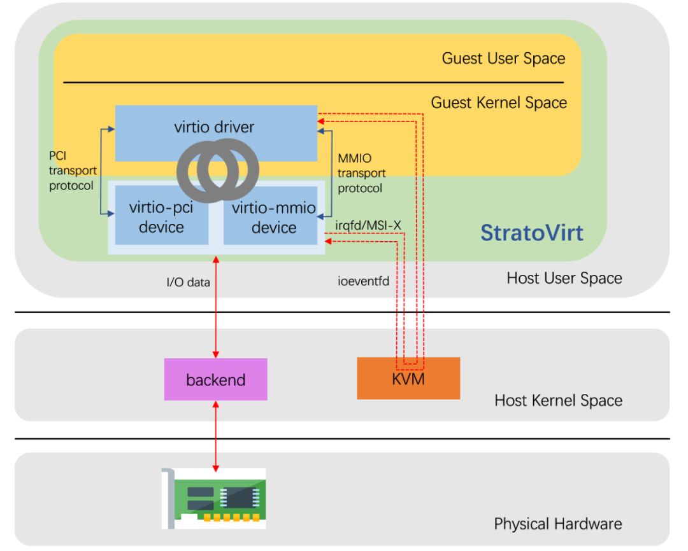

# StratoVirt 的 virtio 设备模拟是如何实现的
virtio 是一种通用的半虚拟化的 I/O 通信协议，提供了一套前后端 I/O 通信的的框架协议和编程接口。根据该协议实现的设备通过前后端的配合，相比全模拟设备可以大幅减少陷入陷出以及内存拷贝的次数，使 guest 获得高效的 I/O 性能。作为目前虚拟化标准的通用协议规范，经历了 0.95、1.0、1.1 三个版本的演进。根据 0.95 版本实现的称为传统 virtio 设备，1.0 版本修改了一些 PCI 配置空间的访问方式和 virtioqueue 的优化和特定设备的约定，1.1 版本则增加了 packed virtqueue 的支持，详细可以参考官方发布的 virtio 协议规范。

之所以称 virtio 是一种半虚拟化的解决方案，是因为其首先需要在主机侧通过软件创建 virito 的后端设备，其次在 Guest 要有对应的设备前端驱动，前后端通过共享内存进行通信。virtio 规范定义了设备的控制和数据面接口，控制面接口包括设备状态、feature 的协商等，数据面则包括共享内存的数据布局定义以及前后端的通知方式。基于 virtio 协议，目前已衍生出了 virtio-blk、virtio-net、virtio-scsi、virtio-mem 等各种各样的半虚拟化设备。virtio 设备可以支持多种传输层协议，既可以挂载到 MMIO 总线，也可以作为 PCI 设备，另外还可以支持基于标准 I/O 通道机制的 S/390 设备。

鉴于 virtio 设备具备较好的性能及通用性，StratoVirt 自然也支持，StratoVirt 中 virtio 设备的实现架构以及 I/O 通信流程如上图所示。下面就基于目前最新的代码，探究一下 StratoVirt 中 virtio 设备的代码实现框架。

ref: https://ost.51cto.com/posts/15169